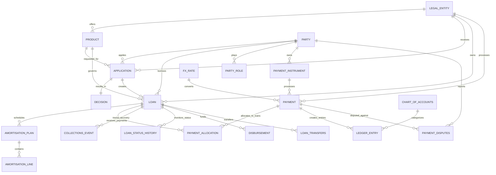
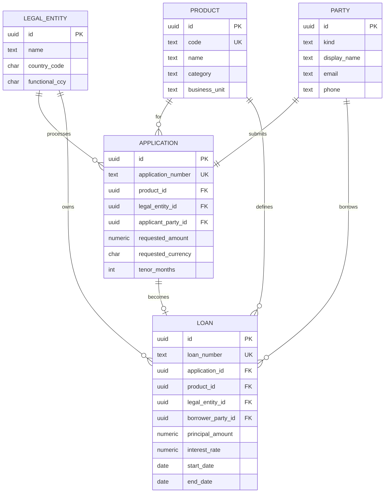

# Rently Lending Platform - Database Schema & API Documentation

**Version:** 1.0  
**Last Updated:** December 2024  
**Document Owner:** Data Architecture & Engineering Team

## Table of Contents
1. [Overview](#overview)
2. [Database Schema Reference](#database-schema-reference)
3. [Table Relationships & Foreign Keys](#table-relationships--foreign-keys)
4. [Key Views & Materialized Views](#key-views--materialized-views)
5. [Example Queries & Usage Patterns](#example-queries--usage-patterns)
6. [Data Dictionary](#data-dictionary)
7. [API Endpoints](#api-endpoints)
8. [Authentication](#authentication)
9. [Error Handling](#error-handling)
10. [Performance Guidelines](#performance-guidelines)

## Overview

The Rently Lending Platform API provides comprehensive access to lending operations, portfolio management, and analytics capabilities. The API follows RESTful design principles with JSON payloads and supports multi-tenancy through legal entity separation.

### API Characteristics
- **Architecture**: RESTful API with JSON responses
- **Authentication**: OAuth 2.0 with role-based access control
- **Versioning**: URL-based versioning (`/api/v1/`)
- **Rate Limiting**: 1000 requests per minute per API key
- **Documentation**: OpenAPI 3.0 specification available
- **Support**: Real-time and batch processing capabilities

### Base URL
```
Production: https://api.rently.com/lending/v1
Staging: https://staging-api.rently.com/lending/v1
Development: https://dev-api.rently.com/lending/v1
```

## Database Schema Reference

### Core Tables Overview

The database consists of 25+ tables organized into logical domains:

#### Business Domain Tables
| Table | Purpose | Key Relationships |
|-------|---------|------------------|
| `legal_entity` | Legal entities operating the platform | Parent to applications, loans, payments |
| `product` | Loan product definitions | Referenced by applications and loans |
| `party` | All individuals and entities | Borrowers, guarantors, agents, brokers |
| `party_role` | Roles parties play in loans | Links parties to specific loans |

#### Application Workflow Tables
| Table | Purpose | Key Relationships |
|-------|---------|------------------|
| `application` | Loan applications | Links applicants to products |
| `decision` | Approval/rejection decisions | One-to-one with applications |
| `loan` | Active loans | Created from approved applications |

#### Financial Transaction Tables
| Table | Purpose | Key Relationships |
|-------|---------|------------------|
| `payment` | All payment transactions | Linked to loans via payment_allocation |
| `payment_allocation` | Payment distribution | Allocates payments to loan components |
| `disbursement` | Loan disbursements | One-to-many from loans |
| `ledger_entry` | Double-entry accounting | References payments, loans, disbursements |

#### Collections and Risk Tables
| Table | Purpose | Key Relationships |
|-------|---------|------------------|
| `collections_event` | Collections activities | Tracks recovery efforts per loan |
| `loan_status_history` | Operational status tracking | Historical status changes |
| `payment_disputes` | Payment discrepancies | Links to payments and loans |

### Enhanced Schema Features (v1.0)

#### 1. Product Categorization
```sql
CREATE TABLE product (
    id UUID PRIMARY KEY,
    code TEXT NOT NULL UNIQUE,
    name TEXT NOT NULL,
    category TEXT NOT NULL CHECK (
        category IN ('rently_care_d2c', 'rently_care_collaborative', 'b2b_sme', 'rnpl_uae')
    ),
    subcategory TEXT,
    business_unit TEXT NOT NULL CHECK (
        business_unit IN ('residential', 'commercial')
    ),
    is_active BOOLEAN DEFAULT true
);
```

#### 2. Loan Status Management
```sql
CREATE TABLE loan_status_history (
    id UUID PRIMARY KEY,
    loan_id UUID REFERENCES loan(id),
    status_type TEXT NOT NULL CHECK (
        status_type IN ('risk_level', 'collections_stage', 'legal_action', 'operational_status')
    ),
    status_value TEXT NOT NULL,
    effective_from TIMESTAMP NOT NULL,
    effective_through TIMESTAMP,
    reason TEXT,
    created_by UUID REFERENCES party(id),
    created_at TIMESTAMP DEFAULT CURRENT_TIMESTAMP
);
```

#### 3. Collections and Risk Management
```sql
CREATE TABLE collections_event (
    id UUID PRIMARY KEY,
    loan_id UUID NOT NULL REFERENCES loan(id),
    event_type TEXT NOT NULL CHECK (
        event_type IN ('reminder_sent', 'phone_call', 'email_sent', 'legal_notice', 
                      'payment_plan', 'recovery_action', 'write_off')
    ),
    event_date DATE NOT NULL,
    amount_overdue NUMERIC(15,2),
    days_past_due INTEGER,
    -- Enhanced collections fields
    consecutive_missed_payments INTEGER,
    escalation_trigger TEXT,
    resolution_status TEXT,
    next_action_date DATE,
    description TEXT,
    created_at TIMESTAMP DEFAULT CURRENT_TIMESTAMP
);

-- Payment dispute management
CREATE TABLE payment_disputes (
    id UUID PRIMARY KEY,
    payment_id UUID REFERENCES payment(id),
    loan_id UUID REFERENCES loan(id),
    dispute_type TEXT NOT NULL CHECK (
        dispute_type IN ('amount_mismatch', 'timing_issue', 'allocation_error', 'duplicate_payment')
    ),
    expected_amount NUMERIC(15,2),
    actual_amount NUMERIC(15,2),
    status TEXT NOT NULL CHECK (
        status IN ('open', 'investigating', 'resolved', 'closed')
    ),
    reported_by UUID REFERENCES party(id),
    assigned_to UUID REFERENCES party(id),
    created_at TIMESTAMP DEFAULT CURRENT_TIMESTAMP,
    resolved_at TIMESTAMP,
    resolution_notes TEXT
);

-- Loan transfers and refinancing
CREATE TABLE loan_transfers (
    id UUID PRIMARY KEY,
    source_loan_id UUID REFERENCES loan(id),
    target_loan_id UUID REFERENCES loan(id),
    transfer_type TEXT NOT NULL CHECK (
        transfer_type IN ('apartment_change', 'lease_renewal', 'refinance', 'consolidation')
    ),
    transfer_amount NUMERIC(15,2),
    transfer_date DATE,
    reason TEXT,
    status TEXT NOT NULL CHECK (
        status IN ('pending', 'completed', 'cancelled')
    ),
    created_at TIMESTAMP DEFAULT CURRENT_TIMESTAMP
);
```

## Table Relationships & Foreign Keys

### Core Entity Relationships

#### Primary Business Flow Relationships


### Key Foreign Key Constraints

#### Critical Business Rules Enforced by FKs
1. **Legal Entity Isolation**: All core entities linked to legal_entity
2. **Party Consistency**: All party references validated against party table
3. **Product Governance**: Applications and loans must reference valid products
4. **Payment Integrity**: Payment allocations must reference existing payments
5. **Audit Trail**: All financial entries linked to source transactions

#### Cascading Delete Rules
- **ON DELETE CASCADE**: Child records automatically deleted
  - `payment_allocation` when `payment` deleted
  - `amortisation_line` when `amortisation_plan` deleted
  - `party_role` when `loan` deleted
  
- **ON DELETE RESTRICT**: Prevents deletion if dependencies exist
  - Cannot delete `party` with active loans
  - Cannot delete `product` with active applications
  - Cannot delete `legal_entity` with active operations

### Indexing Strategy

#### Primary Indexes (for performance)
```sql
-- Loan portfolio queries
CREATE INDEX idx_loan_status_entity ON loan(status, legal_entity_id);
CREATE INDEX idx_loan_borrower_product ON loan(borrower_party_id, product_id);

-- Payment processing queries  
CREATE INDEX idx_payment_date_entity ON payment(received_at, legal_entity_id);
CREATE INDEX idx_payment_allocation_loan ON payment_allocation(loan_id, component);

-- Collections and risk queries
CREATE INDEX idx_collections_loan_date ON collections_event(loan_id, event_date);
CREATE INDEX idx_status_history_loan ON loan_status_history(loan_id, effective_from);

-- Analytics and reporting queries
CREATE INDEX idx_application_date_product ON application(created_at, product_id);
CREATE INDEX idx_disbursement_date_entity ON disbursement(disbursed_at, legal_entity_id);
```

## Key Views & Materialized Views

### Real-Time Operational Views

#### Portfolio Overview Views
```sql
-- Live portfolio health summary
CREATE VIEW v_loan_portfolio_overview AS
SELECT 
    p.category as product_category,
    p.business_unit,
    l.currency_code,
    COUNT(*) as active_loan_count,
    SUM(l.principal_amount) as total_portfolio_value,
    AVG(l.principal_amount) as avg_loan_size,
    COUNT(CASE WHEN ls.status_value = 'default' THEN 1 END) as defaulted_loans,
    SUM(CASE WHEN ls.status_value = 'default' THEN l.principal_amount ELSE 0 END) as defaulted_amount
FROM loan l
JOIN product p ON l.product_id = p.id
LEFT JOIN loan_status_history ls ON l.id = ls.loan_id 
    AND ls.status_type = 'operational_status' 
    AND ls.effective_through IS NULL
WHERE l.status = 'active'
GROUP BY p.category, p.business_unit, l.currency_code;

-- Payment health monitoring
CREATE VIEW v_payment_health_summary AS
SELECT 
    loan_id,
    loan_number,
    borrower_name,
    days_past_due,
    CASE 
        WHEN days_past_due = 0 THEN 'Current'
        WHEN days_past_due BETWEEN 1 AND 30 THEN 'Early Stage'
        WHEN days_past_due BETWEEN 31 AND 60 THEN 'Late Stage'
        WHEN days_past_due BETWEEN 61 AND 90 THEN 'Substandard'
        ELSE 'Doubtful'
    END as risk_category,
    outstanding_principal,
    overdue_amount,
    last_payment_date
FROM (
    SELECT 
        l.id as loan_id,
        l.loan_number,
        p.display_name as borrower_name,
        COALESCE(
            GREATEST(0, CURRENT_DATE - MAX(amort.due_date)), 0
        ) as days_past_due,
        l.principal_amount - COALESCE(SUM(pa.allocated_amount), 0) as outstanding_principal,
        COALESCE(SUM(CASE 
            WHEN amort.due_date < CURRENT_DATE 
                AND amort.principal_amount > COALESCE(pa.allocated_amount, 0)
            THEN amort.principal_amount - COALESCE(pa.allocated_amount, 0)
            ELSE 0 
        END), 0) as overdue_amount,
        MAX(pay.received_at) as last_payment_date
    FROM loan l
    JOIN party p ON l.borrower_party_id = p.id
    LEFT JOIN amortisation_line amort ON l.id = amort.loan_id
    LEFT JOIN payment_allocation pa ON l.id = pa.loan_id AND pa.component = 'principal'
    LEFT JOIN payment pay ON pa.payment_id = pay.id
    WHERE l.status = 'active'
    GROUP BY l.id, l.loan_number, p.display_name, l.principal_amount
) loan_health;
```

#### Collections Performance Views
```sql
-- Collections effectiveness tracking
CREATE VIEW v_collections_performance AS
SELECT 
    DATE_TRUNC('month', ce.event_date) as reporting_month,
    COUNT(DISTINCT ce.loan_id) as loans_in_collections,
    COUNT(ce.id) as total_actions,
    COUNT(CASE WHEN ce.event_type = 'reminder_sent' THEN 1 END) as reminders_sent,
    COUNT(CASE WHEN ce.event_type = 'phone_call' THEN 1 END) as calls_made,
    COUNT(CASE WHEN ce.event_type = 'legal_notice' THEN 1 END) as legal_notices,
    AVG(ce.days_past_due) as avg_dpd,
    SUM(ce.amount_overdue) as total_overdue_amount,
    COUNT(CASE WHEN ce.resolution_status = 'resolved' THEN 1 END) as resolved_cases,
    ROUND(
        COUNT(CASE WHEN ce.resolution_status = 'resolved' THEN 1 END) * 100.0 / 
        COUNT(ce.id), 2
    ) as resolution_rate_pct
FROM collections_event ce
WHERE ce.event_date >= CURRENT_DATE - INTERVAL '12 months'
GROUP BY DATE_TRUNC('month', ce.event_date)
ORDER BY reporting_month DESC;
```

### Advanced Analytics Materialized Views

#### Portfolio Concentration Analysis
```sql
CREATE MATERIALIZED VIEW v_portfolio_concentration_analysis AS
SELECT 
    analysis_date,
    concentration_type,
    concentration_dimension,
    portfolio_value,
    concentration_percentage,
    risk_rating,
    diversification_score
FROM (
    -- Product concentration
    SELECT 
        CURRENT_DATE as analysis_date,
        'product' as concentration_type,
        p.category as concentration_dimension,
        SUM(l.principal_amount) as portfolio_value,
        ROUND(
            SUM(l.principal_amount) * 100.0 / 
            SUM(SUM(l.principal_amount)) OVER (), 2
        ) as concentration_percentage,
        CASE 
            WHEN SUM(l.principal_amount) * 100.0 / SUM(SUM(l.principal_amount)) OVER () > 50 
            THEN 'High Risk'
            WHEN SUM(l.principal_amount) * 100.0 / SUM(SUM(l.principal_amount)) OVER () > 30 
            THEN 'Medium Risk'
            ELSE 'Low Risk'
        END as risk_rating,
        1 - (SUM(l.principal_amount) * 100.0 / SUM(SUM(l.principal_amount)) OVER () / 100.0) as diversification_score
    FROM loan l
    JOIN product p ON l.product_id = p.id
    WHERE l.status = 'active'
    GROUP BY p.category
    
    UNION ALL
    
    -- Geographic concentration
    SELECT 
        CURRENT_DATE as analysis_date,
        'geographic' as concentration_type,
        le.country_code as concentration_dimension,
        SUM(l.principal_amount) as portfolio_value,
        ROUND(
            SUM(l.principal_amount) * 100.0 / 
            SUM(SUM(l.principal_amount)) OVER (), 2
        ) as concentration_percentage,
        CASE 
            WHEN SUM(l.principal_amount) * 100.0 / SUM(SUM(l.principal_amount)) OVER () > 60 
            THEN 'High Risk'
            WHEN SUM(l.principal_amount) * 100.0 / SUM(SUM(l.principal_amount)) OVER () > 40 
            THEN 'Medium Risk'
            ELSE 'Low Risk'
        END as risk_rating,
        1 - (SUM(l.principal_amount) * 100.0 / SUM(SUM(l.principal_amount)) OVER () / 100.0) as diversification_score
    FROM loan l
    JOIN legal_entity le ON l.legal_entity_id = le.id
    WHERE l.status = 'active'
    GROUP BY le.country_code
    
    UNION ALL
    
    -- Currency concentration  
    SELECT 
        CURRENT_DATE as analysis_date,
        'currency' as concentration_type,
        l.currency_code as concentration_dimension,
        SUM(l.principal_amount) as portfolio_value,
        ROUND(
            SUM(l.principal_amount) * 100.0 / 
            SUM(SUM(l.principal_amount)) OVER (), 2
        ) as concentration_percentage,
        CASE 
            WHEN SUM(l.principal_amount) * 100.0 / SUM(SUM(l.principal_amount)) OVER () > 70 
            THEN 'High Risk'
            WHEN SUM(l.principal_amount) * 100.0 / SUM(SUM(l.principal_amount)) OVER () > 50 
            THEN 'Medium Risk'
            ELSE 'Low Risk'
        END as risk_rating,
        1 - (SUM(l.principal_amount) * 100.0 / SUM(SUM(l.principal_amount)) OVER () / 100.0) as diversification_score
    FROM loan l
    WHERE l.status = 'active'
    GROUP BY l.currency_code
) concentration_analysis;
```

#### Cash Flow Projections
```sql
CREATE MATERIALIZED VIEW v_weekly_cash_flow_projections AS
SELECT 
    projection_week,
    week_start_date,
    expected_inflows,
    expected_disbursements,
    net_cash_flow,
    cumulative_cash_flow,
    confidence_level
FROM (
    SELECT 
        generate_series(0, 11) as projection_week,
        (DATE_TRUNC('week', CURRENT_DATE) + (generate_series(0, 11) * INTERVAL '1 week'))::date as week_start_date
) weeks
CROSS JOIN LATERAL (
    SELECT 
        -- Expected inflows from scheduled payments
        COALESCE(SUM(al.principal_amount + al.interest_amount + al.fee_amount), 0) as expected_inflows,
        -- Expected disbursements (conservative estimate)
        COALESCE((SELECT SUM(approved_amount) * 0.8 
                  FROM decision d 
                  JOIN application a ON d.application_id = a.id
                  WHERE d.outcome = 'approved' 
                    AND a.created_at >= weeks.week_start_date - INTERVAL '2 weeks'
                    AND a.created_at <= weeks.week_start_date), 0) as expected_disbursements,
        -- Confidence decreases over time
        CASE 
            WHEN weeks.projection_week <= 2 THEN 'High'
            WHEN weeks.projection_week <= 6 THEN 'Medium'
            ELSE 'Low'
        END as confidence_level
    FROM amortisation_line al
    JOIN loan l ON al.loan_id = l.id
    WHERE al.due_date >= weeks.week_start_date 
      AND al.due_date < weeks.week_start_date + INTERVAL '1 week'
      AND l.status = 'active'
) cash_flows
CROSS JOIN LATERAL (
    SELECT 
        expected_inflows - expected_disbursements as net_cash_flow,
        SUM(expected_inflows - expected_disbursements) 
        OVER (ORDER BY projection_week ROWS UNBOUNDED PRECEDING) as cumulative_cash_flow
) calculations
ORDER BY projection_week;
```

## Example Queries & Usage Patterns

### Common Business Operations

#### 1. Create a New Loan Application
```sql
-- Step 1: Register or verify borrower exists
INSERT INTO party (kind, display_name, email, phone, kyc_identifier)
VALUES ('individual', 'Sarah Chen', 'sarah.chen@email.com', '+65-9876-5432', 'NRIC-S1234567A')
ON CONFLICT (email) DO NOTHING;

-- Step 2: Create loan application
INSERT INTO application (
    application_number, 
    product_id, 
    legal_entity_id, 
    applicant_party_id,
    requested_amount, 
    requested_currency, 
    tenor_months
) 
SELECT 
    'APP-' || EXTRACT(YEAR FROM CURRENT_DATE) || '-' || LPAD(nextval('application_seq')::text, 6, '0'),
    p.id,
    le.id,
    party.id,
    75000.00,
    'SGD',
    24
FROM product p
CROSS JOIN legal_entity le  
CROSS JOIN party
WHERE p.code = 'RC_D2C_RESIDENTIAL_001'
  AND le.country_code = 'SG'
  AND party.email = 'sarah.chen@email.com';

-- Step 3: Record approval decision
INSERT INTO decision (
    application_id,
    outcome,
    approved_amount,
    approved_currency,
    decided_by,
    reason
)
SELECT 
    a.id,
    'approved',
    70000.00, -- Approved for slightly less than requested
    'SGD',
    'underwriter_system',
    'Standard approval - good credit score, stable income'
FROM application a
WHERE a.application_number LIKE 'APP-' || EXTRACT(YEAR FROM CURRENT_DATE) || '%'
  AND a.applicant_party_id = (SELECT id FROM party WHERE email = 'sarah.chen@email.com')
ORDER BY a.created_at DESC
LIMIT 1;
```

#### 2. Process a Payment and Allocation
```sql
-- Step 1: Record incoming payment
INSERT INTO payment (
    legal_entity_id,
    currency_code,
    amount,
    direction,
    payer_party_id,
    payment_instrument_id,
    received_at,
    status,
    external_ref
)
SELECT 
    le.id,
    'SGD',
    3500.00,
    'inbound',
    party.id,
    pi.id,
    CURRENT_TIMESTAMP,
    'completed',
    'TXN-' || generate_random_uuid()
FROM legal_entity le
CROSS JOIN party
CROSS JOIN payment_instrument pi
WHERE le.country_code = 'SG'
  AND party.email = 'sarah.chen@email.com'
  AND pi.party_id = party.id
  AND pi.is_default = true;

-- Step 2: Allocate payment to loan components (waterfall approach)
WITH payment_details AS (
    SELECT p.id as payment_id, p.amount, l.id as loan_id
    FROM payment p
    JOIN party payer ON p.payer_party_id = payer.id
    JOIN loan l ON l.borrower_party_id = payer.id
    WHERE payer.email = 'sarah.chen@email.com'
      AND p.status = 'completed'
    ORDER BY p.created_at DESC
    LIMIT 1
),
loan_balances AS (
    SELECT 
        l.id as loan_id,
        -- Calculate outstanding balances
        COALESCE(SUM(CASE WHEN al.component = 'fee' AND al.due_date <= CURRENT_DATE THEN al.amount END), 0) as overdue_fees,
        COALESCE(SUM(CASE WHEN al.component = 'interest' AND al.due_date <= CURRENT_DATE THEN al.amount END), 0) as overdue_interest,
        COALESCE(SUM(CASE WHEN al.component = 'principal' THEN al.amount END), 0) as total_principal
    FROM loan l
    JOIN amortisation_line al ON l.id = al.loan_id
    WHERE l.id = (SELECT loan_id FROM payment_details)
    GROUP BY l.id
)
INSERT INTO payment_allocation (payment_id, loan_id, component, allocated_amount)
SELECT 
    pd.payment_id,
    pd.loan_id,
    component,
    allocated_amount
FROM payment_details pd
CROSS JOIN loan_balances lb
CROSS JOIN LATERAL (
    VALUES 
        ('fee', LEAST(pd.amount, lb.overdue_fees)),
        ('interest', LEAST(GREATEST(pd.amount - LEAST(pd.amount, lb.overdue_fees), 0), lb.overdue_interest)),
        ('principal', GREATEST(pd.amount - LEAST(pd.amount, lb.overdue_fees) - LEAST(GREATEST(pd.amount - LEAST(pd.amount, lb.overdue_fees), 0), lb.overdue_interest), 0))
) allocations(component, allocated_amount)
WHERE allocated_amount > 0;
```

#### 3. Collections Event Tracking
```sql
-- Log collections activity
INSERT INTO collections_event (
    loan_id,
    event_type,
    event_date,
    amount_overdue,
    days_past_due,
    consecutive_missed_payments,
    escalation_trigger,
    description
)
SELECT 
    l.id,
    'reminder_sent',
    CURRENT_DATE,
    -- Calculate overdue amount
    COALESCE(SUM(CASE 
        WHEN al.due_date < CURRENT_DATE 
        THEN al.amount - COALESCE(pa.allocated_amount, 0)
        ELSE 0 
    END), 0),
    -- Calculate days past due
    GREATEST(0, CURRENT_DATE - MIN(CASE 
        WHEN al.due_date < CURRENT_DATE AND COALESCE(pa.allocated_amount, 0) < al.amount
        THEN al.due_date 
    END)),
    -- Count consecutive missed payments
    (SELECT COUNT(*) 
     FROM amortisation_line al2 
     WHERE al2.loan_id = l.id 
       AND al2.due_date < CURRENT_DATE
       AND COALESCE((SELECT SUM(pa2.allocated_amount) 
                     FROM payment_allocation pa2 
                     WHERE pa2.loan_id = l.id 
                       AND pa2.component = al2.component), 0) < al2.amount),
    '30_days_overdue',
    'Automated reminder sent via email and SMS for overdue payment'
FROM loan l
JOIN party p ON l.borrower_party_id = p.id
LEFT JOIN amortisation_line al ON l.id = al.loan_id
LEFT JOIN payment_allocation pa ON l.id = pa.loan_id AND pa.component = al.component
WHERE p.email = 'sarah.chen@email.com'
  AND l.status = 'active'
GROUP BY l.id
HAVING COALESCE(SUM(CASE 
    WHEN al.due_date < CURRENT_DATE 
    THEN al.amount - COALESCE(pa.allocated_amount, 0)
    ELSE 0 
END), 0) > 0;
```

### Analytics and Reporting Queries

#### 4. Portfolio Health Dashboard Query
```sql
-- Comprehensive portfolio health summary
SELECT 
    'Portfolio Overview' as metric_category,
    JSON_BUILD_OBJECT(
        'total_active_loans', COUNT(*),
        'total_portfolio_value', SUM(l.principal_amount),
        'avg_loan_size', AVG(l.principal_amount),
        'product_mix', JSON_OBJECT_AGG(p.category, category_stats.loan_count),
        'risk_distribution', JSON_OBJECT_AGG(risk_stats.risk_category, risk_stats.loan_count),
        'currency_exposure', JSON_OBJECT_AGG(l.currency_code, currency_stats.portfolio_value)
    ) as metrics
FROM loan l
JOIN product p ON l.product_id = p.id
LEFT JOIN (
    SELECT 
        l.product_id,
        COUNT(*) as loan_count
    FROM loan l
    WHERE l.status = 'active'
    GROUP BY l.product_id
) category_stats ON p.id = category_stats.product_id
LEFT JOIN (
    SELECT 
        l.id as loan_id,
        CASE 
            WHEN MAX(CASE WHEN al.due_date < CURRENT_DATE THEN 1 ELSE 0 END) = 0 THEN 'Current'
            WHEN MAX(CURRENT_DATE - al.due_date) BETWEEN 1 AND 30 THEN 'Early Stage'
            WHEN MAX(CURRENT_DATE - al.due_date) BETWEEN 31 AND 90 THEN 'Late Stage'
            ELSE 'Substandard'
        END as risk_category
    FROM loan l
    LEFT JOIN amortisation_line al ON l.id = al.loan_id
    WHERE l.status = 'active'
    GROUP BY l.id
) loan_risk ON l.id = loan_risk.loan_id
LEFT JOIN (
    SELECT 
        risk_category,
        COUNT(*) as loan_count
    FROM (
        SELECT 
            l.id,
            CASE 
                WHEN MAX(CASE WHEN al.due_date < CURRENT_DATE THEN 1 ELSE 0 END) = 0 THEN 'Current'
                WHEN MAX(CURRENT_DATE - al.due_date) BETWEEN 1 AND 30 THEN 'Early Stage'
                WHEN MAX(CURRENT_DATE - al.due_date) BETWEEN 31 AND 90 THEN 'Late Stage'
                ELSE 'Substandard'
            END as risk_category
        FROM loan l
        LEFT JOIN amortisation_line al ON l.id = al.loan_id
        WHERE l.status = 'active'
        GROUP BY l.id
    ) risk_breakdown
    GROUP BY risk_category
) risk_stats ON loan_risk.risk_category = risk_stats.risk_category
LEFT JOIN (
    SELECT 
        currency_code,
        SUM(principal_amount) as portfolio_value
    FROM loan
    WHERE status = 'active'
    GROUP BY currency_code
) currency_stats ON l.currency_code = currency_stats.currency_code
WHERE l.status = 'active';
```

#### 5. Collections Performance Analysis
```sql
-- Collections effectiveness over the last 6 months
SELECT 
    reporting_month,
    loans_in_collections,
    total_recovery_actions,
    successful_recoveries,
    ROUND(successful_recoveries::numeric / NULLIF(total_recovery_actions, 0) * 100, 2) as success_rate_pct,
    avg_days_to_resolution,
    total_amount_recovered,
    recovery_rate_pct
FROM (
    SELECT 
        DATE_TRUNC('month', ce.event_date) as reporting_month,
        COUNT(DISTINCT ce.loan_id) as loans_in_collections,
        COUNT(ce.id) as total_recovery_actions,
        COUNT(CASE WHEN ce.resolution_status = 'resolved' THEN 1 END) as successful_recoveries,
        AVG(CASE 
            WHEN ce.resolution_status = 'resolved' 
            THEN EXTRACT(EPOCH FROM (
                COALESCE(
                    (SELECT MIN(ce2.event_date) 
                     FROM collections_event ce2 
                     WHERE ce2.loan_id = ce.loan_id 
                       AND ce2.resolution_status = 'resolved'), 
                    ce.event_date
                ) - ce.event_date
            )) / 86400 
        END) as avg_days_to_resolution,
        SUM(CASE WHEN ce.resolution_status = 'resolved' THEN ce.amount_overdue ELSE 0 END) as total_amount_recovered,
        ROUND(
            SUM(CASE WHEN ce.resolution_status = 'resolved' THEN ce.amount_overdue ELSE 0 END) * 100.0 /
            NULLIF(SUM(ce.amount_overdue), 0), 2
        ) as recovery_rate_pct
    FROM collections_event ce
    WHERE ce.event_date >= CURRENT_DATE - INTERVAL '6 months'
    GROUP BY DATE_TRUNC('month', ce.event_date)
) collections_summary
ORDER BY reporting_month DESC;
```

## Data Dictionary

### Core Entities Data Dictionary

| Table | Column | Data Type | Constraints | Description | Business Rules |
|-------|--------|-----------|-------------|-------------|----------------|
| **legal_entity** | id | UUID | PRIMARY KEY | Unique identifier | Auto-generated UUID |
| | name | TEXT | NOT NULL | Legal entity name | Must be unique per country |
| | country_code | CHAR(2) | NOT NULL | ISO country code | Must be valid ISO 3166-1 |
| | functional_ccy | CHAR(3) | NOT NULL | Functional currency | Must be valid ISO 4217 |
| **product** | category | TEXT | NOT NULL | Product category | rently_care_d2c, rently_care_collaborative, b2b_sme, rnpl_uae |
| | business_unit | TEXT | NOT NULL | Business unit | residential, commercial |
| **party** | kind | TEXT | NOT NULL | Party type | individual, corporate, agent, broker, landlord, guarantor |
| | kyc_identifier | TEXT | UNIQUE | KYC identifier | Must be unique, required for borrowers |
| **loan** | status | TEXT | NOT NULL | Loan status | active, closed, written_off, transferred |
| | installment_period | TEXT | | Rental installment | Format: 'n/12' where n is months paid |
| | lease_start_date | DATE | | Lease start | Required for rental products |
| | agent_party_id | UUID | FOREIGN KEY | Referring agent | References party.id |
| **payment** | direction | TEXT | NOT NULL | Payment direction | inbound, outbound |
| | status | TEXT | NOT NULL | Payment status | pending, completed, failed, reversed |
| **collections_event** | event_type | TEXT | NOT NULL | Collections action | reminder_sent, phone_call, legal_notice, etc. |
| | resolution_status | TEXT | | Resolution outcome | open, investigating, resolved, closed |

### Enhanced Fields for Rental Operations

| Table | Column | Purpose | Example Values |
|-------|--------|---------|----------------|
| loan | installment_period | Track rental payment schedule | '1/12', '2/12', '3/12' |
| loan | lease_start_date | Lease commencement | '2024-01-01' |
| loan | lease_end_date | Lease expiration | '2024-12-31' |
| loan | agent_party_id | Referring real estate agent | UUID reference |
| collections_event | consecutive_missed_payments | Escalation trigger | 1, 2, 3... |
| collections_event | escalation_trigger | Reason for escalation | '30_days_overdue', 'third_missed_payment' |

### View Definitions Dictionary

| View Name | Refresh Type | Purpose | Key Metrics |
|-----------|--------------|---------|-------------|
| v_loan_portfolio_overview | Real-time | Portfolio composition monitoring | Active loans, portfolio value, default rates by category |
| v_payment_health_summary | Real-time | Payment status tracking | DPD analysis, risk categorization, overdue amounts |
| v_collections_performance | Near real-time | Collections effectiveness | Recovery rates, resolution times, action counts |
| v_weekly_cash_flow_projections | Materialized (daily) | Cash flow forecasting | 12-week forward projections, confidence levels |
| v_portfolio_concentration_analysis | Materialized (hourly) | Risk concentration monitoring | Product, geographic, currency concentration |
| v_currency_risk_analysis | Near real-time | FX exposure tracking | Currency exposure, hedging requirements |
```sql
ALTER TABLE loan ADD COLUMN installment_period TEXT CHECK (
    installment_period IS NULL OR installment_period ~* '^\d+/\d+$'
);
ALTER TABLE loan ADD COLUMN lease_start_date DATE;
ALTER TABLE loan ADD COLUMN lease_end_date DATE;
ALTER TABLE loan ADD COLUMN agent_party_id UUID REFERENCES party(id);
```

### Table Relationships

#### Core Entity Relationships


### Constraints and Validations

#### Business Rule Constraints
```sql
-- Amount validations
CONSTRAINT application_amount_positive CHECK (requested_amount > 0)
CONSTRAINT loan_amounts_positive CHECK (principal_amount > 0)
CONSTRAINT payment_amount_positive CHECK (amount > 0)

-- Date validations  
CONSTRAINT loan_dates_check CHECK (end_date > start_date)
CONSTRAINT lease_dates_check CHECK (lease_end_date IS NULL OR lease_start_date IS NULL OR lease_end_date > lease_start_date)

-- Status validations
CONSTRAINT application_status_check CHECK (status IN ('submitted', 'under_review', 'approved', 'rejected', 'withdrawn'))
CONSTRAINT loan_status_check CHECK (status IN ('active', 'closed', 'written_off', 'transferred'))
CONSTRAINT payment_status_check CHECK (status IN ('pending', 'processing', 'completed', 'failed', 'cancelled'))

-- Currency validations
CONSTRAINT currency_code_check CHECK (LENGTH(currency_code) = 3)

-- Email validations
CONSTRAINT party_email_check CHECK (email IS NULL OR email ~* '^[A-Za-z0-9._%+-]+@[A-Za-z0-9.-]+\.[A-Za-z]{2,}$')
```

## API Endpoints

### Authentication Endpoints

#### POST /auth/login
Authenticate user and obtain access token.

**Request:**
```json
{
  "username": "user@rently.com",
  "password": "securePassword",
  "mfa_code": "123456"
}
```

**Response:**
```json
{
  "access_token": "eyJhbGciOiJIUzI1NiIs...",
  "refresh_token": "eyJhbGciOiJIUzI1NiIs...",
  "expires_in": 3600,
  "token_type": "Bearer",
  "user": {
    "id": "uuid",
    "email": "user@rently.com",
    "roles": ["portfolio_manager"],
    "permissions": ["read:loans", "write:collections"]
  }
}
```

### Legal Entity Management

#### GET /api/v1/legal-entities
Retrieve all legal entities.

**Parameters:**
- `country_code` (optional): Filter by country
- `active` (optional): Filter active entities

**Response:**
```json
{
  "data": [
    {
      "id": "uuid",
      "name": "Rently Technologies Pte Ltd",
      "registration_no": "202012345A",
      "country_code": "SG",
      "functional_ccy": "SGD",
      "created_at": "2024-01-01T00:00:00Z"
    }
  ],
  "meta": {
    "total": 1,
    "page": 1,
    "per_page": 50
  }
}
```

### Product Management

#### GET /api/v1/products
Retrieve loan products.

**Parameters:**
- `category`: Product category filter
- `business_unit`: Business unit filter
- `active`: Active products only

**Response:**
```json
{
  "data": [
    {
      "id": "uuid",
      "code": "RC_D2C_001",
      "name": "Rently Care D2C Standard",
      "description": "Standard D2C rental financing",
      "category": "rently_care_d2c",
      "subcategory": "standard",
      "business_unit": "residential",
      "is_active": true
    }
  ]
}
```

#### POST /api/v1/products
Create new loan product.

**Request:**
```json
{
  "code": "RC_NEW_001",
  "name": "New Product",
  "description": "Product description",
  "category": "rently_care_d2c",
  "subcategory": "premium",
  "business_unit": "residential"
}
```

### Party Management

#### GET /api/v1/parties
Retrieve parties (customers, guarantors, etc.).

**Parameters:**
- `kind`: Party type filter
- `search`: Search by name or email
- `active`: Active parties only

**Response:**
```json
{
  "data": [
    {
      "id": "uuid",
      "kind": "individual",
      "display_name": "John Doe",
      "email": "john@example.com",
      "phone": "+65-9123-4567",
      "external_ref": "CUST001",
      "kyc_identifier": "S1234567A",
      "is_active": true,
      "created_at": "2024-01-01T00:00:00Z"
    }
  ]
}
```

#### POST /api/v1/parties
Register new party.

**Request:**
```json
{
  "kind": "individual",
  "display_name": "Jane Smith",
  "email": "jane@example.com",
  "phone": "+65-9876-5432",
  "external_ref": "CUST002",
  "kyc_identifier": "S9876543B"
}
```

### Application Management

#### GET /api/v1/applications
Retrieve loan applications.

**Parameters:**
- `status`: Application status
- `product_id`: Filter by product
- `applicant_id`: Filter by applicant
- `date_from`, `date_to`: Date range filter

**Response:**
```json
{
  "data": [
    {
      "id": "uuid",
      "application_number": "APP-20240101-001",
      "product": {
        "id": "uuid",
        "code": "RC_D2C_001",
        "name": "Rently Care D2C Standard"
      },
      "applicant": {
        "id": "uuid",
        "display_name": "John Doe",
        "email": "john@example.com"
      },
      "requested_amount": 50000.00,
      "requested_currency": "SGD",
      "tenor_months": 12,
      "status": "under_review",
      "created_at": "2024-01-01T00:00:00Z"
    }
  ]
}
```

#### POST /api/v1/applications
Create new loan application.

**Request:**
```json
{
  "product_id": "uuid",
  "legal_entity_id": "uuid",
  "applicant_party_id": "uuid",
  "requested_amount": 50000.00,
  "requested_currency": "SGD",
  "tenor_months": 12
}
```

#### POST /api/v1/applications/{id}/decision
Record application decision.

**Request:**
```json
{
  "outcome": "approved",
  "approved_amount": 45000.00,
  "approved_currency": "SGD",
  "decided_by": "John Underwriter",
  "reason": "Approved with reduced amount due to DTI ratio"
}
```

### Loan Management

#### GET /api/v1/loans
Retrieve loans.

**Parameters:**
- `status`: Loan status filter
- `borrower_id`: Filter by borrower
- `product_id`: Filter by product
- `legal_entity_id`: Filter by legal entity

**Response:**
```json
{
  "data": [
    {
      "id": "uuid",
      "loan_number": "LOAN-20240101-001",
      "application_id": "uuid",
      "product": {
        "id": "uuid",
        "code": "RC_D2C_001",
        "name": "Rently Care D2C Standard"
      },
      "borrower": {
        "id": "uuid",
        "display_name": "John Doe",
        "email": "john@example.com"
      },
      "currency_code": "SGD",
      "principal_amount": 45000.00,
      "interest_rate": 0.0850,
      "rc_fee_rate": 0.0200,
      "start_date": "2024-01-15",
      "end_date": "2025-01-15",
      "status": "active",
      "installment_period": "1/12",
      "lease_start_date": "2024-01-15",
      "lease_end_date": "2025-01-15",
      "agent": {
        "id": "uuid",
        "display_name": "Property Agent Co"
      }
    }
  ]
}
```

#### POST /api/v1/loans
Create new loan (typically from approved application).

**Request:**
```json
{
  "application_id": "uuid",
  "product_id": "uuid",
  "legal_entity_id": "uuid",
  "borrower_party_id": "uuid",
  "currency_code": "SGD",
  "principal_amount": 45000.00,
  "interest_rate": 0.0850,
  "rc_fee_rate": 0.0200,
  "start_date": "2024-01-15",
  "end_date": "2025-01-15",
  "installment_period": "1/12",
  "lease_start_date": "2024-01-15",
  "lease_end_date": "2025-01-15",
  "agent_party_id": "uuid"
}
```

#### GET /api/v1/loans/{id}/amortization
Retrieve loan amortization schedule.

**Response:**
```json
{
  "loan_id": "uuid",
  "current_plan": {
    "id": "uuid",
    "version": 1,
    "status": "active",
    "effective_from": "2024-01-15",
    "lines": [
      {
        "seq_no": 1,
        "due_date": "2024-02-15",
        "currency_code": "SGD",
        "amount_principal": 3750.00,
        "amount_rc_fee": 900.00,
        "amount_penalty": 0.00,
        "amount_other": 0.00,
        "total_amount": 4650.00
      }
    ]
  }
}
```

### Payment Processing

#### GET /api/v1/payments
Retrieve payment transactions.

**Parameters:**
- `status`: Payment status
- `direction`: inbound/outbound
- `currency_code`: Currency filter
- `date_from`, `date_to`: Date range

**Response:**
```json
{
  "data": [
    {
      "id": "uuid",
      "legal_entity_id": "uuid",
      "currency_code": "SGD",
      "amount": 4650.00,
      "direction": "inbound",
      "provider": "DBS Bank",
      "external_reference": "TXN123456789",
      "payer": {
        "id": "uuid",
        "display_name": "John Doe"
      },
      "instrument": {
        "id": "uuid",
        "instrument_type": "bank_account",
        "bank_name": "DBS Bank"
      },
      "received_at": "2024-02-15T10:30:00Z",
      "processed_at": "2024-02-15T10:35:00Z",
      "status": "completed",
      "allocations": [
        {
          "loan_id": "uuid",
          "component": "principal",
          "allocated_amount": 3750.00
        },
        {
          "loan_id": "uuid", 
          "component": "rc_fee",
          "allocated_amount": 900.00
        }
      ]
    }
  ]
}
```

#### POST /api/v1/payments
Record new payment.

**Request:**
```json
{
  "legal_entity_id": "uuid",
  "currency_code": "SGD",
  "amount": 4650.00,
  "direction": "inbound",
  "provider": "DBS Bank",
  "external_reference": "TXN123456789",
  "payer_party_id": "uuid",
  "instrument_id": "uuid",
  "received_at": "2024-02-15T10:30:00Z"
}
```

#### POST /api/v1/payments/{id}/allocate
Allocate payment to loan components.

**Request:**
```json
{
  "allocations": [
    {
      "loan_id": "uuid",
      "plan_id": "uuid",
      "line_id": "uuid",
      "component": "principal",
      "allocated_amount": 3750.00
    },
    {
      "loan_id": "uuid",
      "plan_id": "uuid", 
      "line_id": "uuid",
      "component": "rc_fee",
      "allocated_amount": 900.00
    }
  ]
}
```

### Collections Management

#### GET /api/v1/collections/events
Retrieve collections events.

**Parameters:**
- `loan_id`: Filter by loan
- `event_type`: Event type filter
- `dpd_min`, `dpd_max`: DPD range filter

**Response:**
```json
{
  "data": [
    {
      "id": "uuid",
      "loan": {
        "id": "uuid",
        "loan_number": "LOAN-20240101-001"
      },
      "event_type": "reminder_sent",
      "event_at": "2024-03-01T09:00:00Z",
      "actor": {
        "id": "uuid",
        "display_name": "Collections Agent"
      },
      "dpd_snapshot": 15,
      "amount_involved": 4650.00,
      "currency_code": "SGD",
      "consecutive_missed_payments": 1,
      "escalation_trigger": "auto_reminder_15dpd",
      "resolution_status": "pending",
      "next_action_date": "2024-03-08",
      "notes": "SMS reminder sent to borrower"
    }
  ]
}
```

#### POST /api/v1/collections/events
Log new collections event.

**Request:**
```json
{
  "loan_id": "uuid",
  "event_type": "call_successful",
  "actor_party_id": "uuid",
  "dpd_snapshot": 20,
  "amount_involved": 4650.00,
  "currency_code": "SGD",
  "consecutive_missed_payments": 1,
  "escalation_trigger": "manual_intervention",
  "resolution_status": "in_progress",
  "next_action_date": "2024-03-15",
  "notes": "Spoke with borrower, payment promised by March 15th"
}
```

### Analytics and Reporting

#### GET /api/v1/analytics/portfolio/overview
Portfolio overview analytics.

**Response:**
```json
{
  "data": {
    "total_active_loans": 1250,
    "active_portfolio_value": 125000000.00,
    "average_loan_size": 100000.00,
    "currency_breakdown": {
      "SGD": {
        "loan_count": 800,
        "portfolio_value": 80000000.00
      },
      "USD": {
        "loan_count": 300,
        "portfolio_value": 30000000.00
      },
      "AED": {
        "loan_count": 150,
        "portfolio_value": 15000000.00
      }
    },
    "product_breakdown": {
      "rently_care_d2c": {
        "loan_count": 600,
        "portfolio_value": 45000000.00
      },
      "rently_care_collaborative": {
        "loan_count": 400,
        "portfolio_value": 40000000.00
      },
      "b2b_sme": {
        "loan_count": 200,
        "portfolio_value": 35000000.00
      },
      "rnpl_uae": {
        "loan_count": 50,
        "portfolio_value": 5000000.00
      }
    }
  }
}
```

#### GET /api/v1/analytics/cash-flow/projections
Cash flow projections.

**Parameters:**
- `weeks`: Number of weeks to project (default: 12)
- `currency`: Currency filter

**Response:**
```json
{
  "data": {
    "projections": [
      {
        "week_start_date": "2024-03-04",
        "week_end_date": "2024-03-10",
        "expected_collections": 2500000.00,
        "scheduled_disbursements": 1800000.00,
        "net_cash_flow": 700000.00,
        "confidence_level": "high"
      }
    ],
    "summary": {
      "total_expected_collections": 30000000.00,
      "total_disbursements": 21600000.00,
      "net_cash_flow": 8400000.00
    }
  }
}
```

## Data Models

### Core Data Transfer Objects (DTOs)

#### LoanSummaryDTO
```typescript
interface LoanSummaryDTO {
  id: string;
  loanNumber: string;
  borrower: PartyDTO;
  product: ProductDTO;
  principalAmount: number;
  currency: string;
  interestRate: number;
  startDate: string;
  endDate: string;
  status: LoanStatus;
  currentDPD: number;
  nextPaymentDate: string;
  nextPaymentAmount: number;
}
```

#### PaymentDTO
```typescript
interface PaymentDTO {
  id: string;
  amount: number;
  currency: string;
  direction: 'inbound' | 'outbound';
  status: PaymentStatus;
  receivedAt: string;
  processedAt: string;
  payer: PartyDTO;
  allocations: PaymentAllocationDTO[];
}
```

#### CollectionsEventDTO
```typescript
interface CollectionsEventDTO {
  id: string;
  loan: LoanSummaryDTO;
  eventType: CollectionsEventType;
  eventAt: string;
  actor: PartyDTO;
  dpdSnapshot: number;
  amountInvolved: number;
  resolutionStatus: string;
  nextActionDate: string;
  notes: string;
}
```

## Query Examples

### Common Business Queries

#### Find Overdue Loans
```sql
-- Loans currently overdue with DPD calculation
SELECT 
    l.loan_number,
    p.display_name as borrower_name,
    l.principal_amount,
    l.currency_code,
    (CURRENT_DATE - al.due_date) as days_past_due,
    SUM(al.amount_principal + al.amount_rc_fee + al.amount_penalty + al.amount_other) 
        - COALESCE(paid.total_paid, 0) as outstanding_amount
FROM loan l
JOIN party p ON l.borrower_party_id = p.id
JOIN amortisation_plan ap ON l.id = ap.loan_id AND ap.status = 'active'
JOIN amortisation_line al ON ap.id = al.plan_id
LEFT JOIN (
    SELECT 
        pa.loan_id,
        SUM(pa.allocated_amount) as total_paid
    FROM payment_allocation pa
    JOIN payment py ON pa.payment_id = py.id
    WHERE py.status = 'completed'
    GROUP BY pa.loan_id
) paid ON l.id = paid.loan_id
WHERE al.due_date < CURRENT_DATE
  AND l.status = 'active'
GROUP BY l.id, l.loan_number, p.display_name, l.principal_amount, l.currency_code, al.due_date, paid.total_paid
HAVING SUM(al.amount_principal + al.amount_rc_fee + al.amount_penalty + al.amount_other) 
       - COALESCE(paid.total_paid, 0) > 0
ORDER BY days_past_due DESC;
```

#### Portfolio Performance by Product
```sql
-- Portfolio performance metrics by product category
SELECT 
    pr.category,
    pr.business_unit,
    COUNT(l.id) as loan_count,
    SUM(l.principal_amount) as total_principal,
    AVG(l.interest_rate) as avg_interest_rate,
    COUNT(CASE WHEN dpd.current_dpd > 30 THEN 1 END) as overdue_30plus_count,
    COUNT(CASE WHEN dpd.current_dpd > 90 THEN 1 END) as overdue_90plus_count,
    SUM(CASE WHEN dpd.current_dpd > 30 THEN l.principal_amount ELSE 0 END) as overdue_30plus_amount
FROM loan l
JOIN product pr ON l.product_id = pr.id
LEFT JOIN (
    SELECT 
        loan_id,
        MAX(dpd_snapshot) as current_dpd
    FROM collections_event
    WHERE event_at >= CURRENT_DATE - INTERVAL '7 days'
    GROUP BY loan_id
) dpd ON l.id = dpd.loan_id
WHERE l.status = 'active'
GROUP BY pr.category, pr.business_unit
ORDER BY total_principal DESC;
```

#### Collections Performance Analysis
```sql
-- Collections performance by stage and resolution
SELECT 
    event_type,
    resolution_status,
    COUNT(*) as event_count,
    COUNT(DISTINCT loan_id) as unique_loans,
    AVG(dpd_snapshot) as avg_dpd,
    AVG(EXTRACT(EPOCH FROM (
        COALESCE(next_action_date::timestamp, CURRENT_TIMESTAMP) - event_at
    )) / 86400) as avg_resolution_days,
    SUM(amount_involved) as total_amount_involved
FROM collections_event
WHERE event_at >= CURRENT_DATE - INTERVAL '90 days'
GROUP BY event_type, resolution_status
ORDER BY event_type, resolution_status;
```

#### Payment Allocation Waterfall
```sql
-- Payment allocation following waterfall priority
WITH payment_waterfall AS (
    SELECT 
        pa.payment_id,
        pa.loan_id,
        pa.component,
        pa.allocated_amount,
        CASE pa.component
            WHEN 'penalty' THEN 1
            WHEN 'rc_fee' THEN 2
            WHEN 'principal' THEN 3
            WHEN 'other' THEN 4
            ELSE 5
        END as priority_order
    FROM payment_allocation pa
    JOIN payment p ON pa.payment_id = p.id
    WHERE p.received_at >= CURRENT_DATE - INTERVAL '30 days'
      AND p.status = 'completed'
)
SELECT 
    l.loan_number,
    p.amount as payment_amount,
    p.currency_code,
    STRING_AGG(
        pw.component || ': ' || pw.allocated_amount::text, 
        ', ' ORDER BY pw.priority_order
    ) as allocation_breakdown
FROM payment p
JOIN payment_waterfall pw ON p.id = pw.payment_id
JOIN loan l ON pw.loan_id = l.id
GROUP BY l.loan_number, p.amount, p.currency_code, p.received_at
ORDER BY p.received_at DESC;
```

### Advanced Analytics Queries

#### Cohort Analysis by Origination Month
```sql
-- Loan performance by origination cohort
SELECT 
    DATE_TRUNC('month', l.start_date) as origination_month,
    COUNT(*) as loans_originated,
    SUM(l.principal_amount) as amount_originated,
    COUNT(CASE WHEN l.status = 'active' THEN 1 END) as still_active,
    COUNT(CASE WHEN l.status = 'closed' THEN 1 END) as closed_performing,
    COUNT(CASE WHEN l.status = 'written_off' THEN 1 END) as written_off,
    ROUND(
        COUNT(CASE WHEN l.status = 'written_off' THEN 1 END)::numeric / 
        COUNT(*)::numeric * 100, 2
    ) as default_rate_percent
FROM loan l
WHERE l.start_date >= '2023-01-01'
GROUP BY DATE_TRUNC('month', l.start_date)
ORDER BY origination_month;
```

#### Multi-Currency Portfolio Analysis
```sql
-- Portfolio analysis with FX impact
SELECT 
    l.currency_code,
    COUNT(*) as loan_count,
    SUM(l.principal_amount) as portfolio_value_original,
    SUM(l.principal_amount * COALESCE(fx.rate, 1)) as portfolio_value_functional,
    AVG(l.interest_rate) as avg_interest_rate,
    MAX(fx.as_of_date) as fx_rate_date
FROM loan l
LEFT JOIN fx_rate fx ON (
    l.currency_code = fx.from_ccy 
    AND fx.to_ccy = 'SGD'  -- Assuming SGD as functional currency
    AND fx.as_of_date = (
        SELECT MAX(as_of_date) 
        FROM fx_rate fx2 
        WHERE fx2.from_ccy = fx.from_ccy 
          AND fx2.to_ccy = fx.to_ccy
    )
)
WHERE l.status = 'active'
GROUP BY l.currency_code
ORDER BY portfolio_value_functional DESC;
```

## Analytics Views

The system includes 50+ analytical views for reporting and dashboard purposes. Here are key views:

### Portfolio Management Views

#### v_loan_portfolio_overview
```sql
-- Comprehensive portfolio overview by dimensions
CREATE VIEW v_loan_portfolio_overview AS
SELECT 
    le.name as legal_entity_name,
    le.country_code,
    pr.category as product_category,
    pr.business_unit,
    l.currency_code,
    l.status as loan_status,
    COUNT(*) as active_loan_count,
    SUM(l.principal_amount) as total_principal_amount,
    AVG(l.interest_rate) as average_interest_rate,
    AVG(l.rc_fee_rate) as average_rc_fee_rate,
    MIN(l.start_date) as earliest_start_date,
    MAX(l.end_date) as latest_end_date,
    COUNT(CASE WHEN CURRENT_DATE > l.end_date THEN 1 END) as overdue_count
FROM loan l
JOIN legal_entity le ON l.legal_entity_id = le.id
JOIN product pr ON l.product_id = pr.id
WHERE l.status = 'active'
GROUP BY le.name, le.country_code, pr.category, pr.business_unit, l.currency_code, l.status;
```

#### v_payment_health_summary
```sql
-- Payment health indicators
CREATE VIEW v_payment_health_summary AS
WITH loan_dpd AS (
    SELECT 
        l.id as loan_id,
        l.loan_number,
        l.principal_amount,
        l.currency_code,
        COALESCE(MAX(ce.dpd_snapshot), 0) as current_dpd,
        CASE 
            WHEN COALESCE(MAX(ce.dpd_snapshot), 0) = 0 THEN 'Current'
            WHEN COALESCE(MAX(ce.dpd_snapshot), 0) BETWEEN 1 AND 30 THEN 'Early Overdue'
            WHEN COALESCE(MAX(ce.dpd_snapshot), 0) BETWEEN 31 AND 60 THEN 'Moderate Overdue'
            WHEN COALESCE(MAX(ce.dpd_snapshot), 0) BETWEEN 61 AND 90 THEN 'Significant Overdue'
            ELSE 'Severe Overdue'
        END as risk_category
    FROM loan l
    LEFT JOIN collections_event ce ON l.id = ce.loan_id
    WHERE l.status = 'active'
    GROUP BY l.id, l.loan_number, l.principal_amount, l.currency_code
)
SELECT 
    risk_category,
    COUNT(*) as loan_count,
    SUM(principal_amount) as total_amount,
    ROUND(COUNT(*)::numeric / SUM(COUNT(*)) OVER () * 100, 2) as percentage_of_portfolio,
    AVG(current_dpd) as avg_dpd
FROM loan_dpd
GROUP BY risk_category;
```

### Collections Analytics Views

#### v_collections_performance
```sql
-- Collections performance metrics
CREATE VIEW v_collections_performance AS
WITH monthly_collections AS (
    SELECT 
        DATE_TRUNC('month', event_at) as reporting_month,
        event_type,
        COUNT(*) as event_count,
        COUNT(DISTINCT loan_id) as unique_loans_affected,
        AVG(dpd_snapshot) as avg_dpd,
        COUNT(CASE WHEN resolution_status = 'resolved' THEN 1 END) as resolved_count,
        AVG(CASE 
            WHEN resolution_status = 'resolved' 
            THEN EXTRACT(EPOCH FROM (next_action_date::timestamp - event_at)) / 86400 
        END) as avg_resolution_days
    FROM collections_event
    WHERE event_at >= CURRENT_DATE - INTERVAL '12 months'
    GROUP BY DATE_TRUNC('month', event_at), event_type
)
SELECT 
    reporting_month,
    event_type,
    event_count,
    unique_loans_affected,
    avg_dpd,
    resolved_count,
    ROUND(resolved_count::numeric / event_count::numeric * 100, 2) as resolution_rate_percent,
    avg_resolution_days
FROM monthly_collections
ORDER BY reporting_month DESC, event_type;
```

### Cash Flow Analysis Views

#### v_weekly_cash_flow_projections
```sql
-- 12-week cash flow projections
CREATE VIEW v_weekly_cash_flow_projections AS
WITH weeks AS (
    SELECT 
        generate_series(
            DATE_TRUNC('week', CURRENT_DATE),
            DATE_TRUNC('week', CURRENT_DATE) + INTERVAL '11 weeks',
            INTERVAL '1 week'
        )::date as week_start_date
),
expected_collections AS (
    SELECT 
        DATE_TRUNC('week', al.due_date) as week_start_date,
        SUM(al.amount_principal + al.amount_rc_fee + al.amount_penalty + al.amount_other) as expected_amount
    FROM amortisation_line al
    JOIN amortisation_plan ap ON al.plan_id = ap.id
    JOIN loan l ON ap.loan_id = l.id
    WHERE ap.status = 'active'
      AND l.status = 'active'
      AND al.due_date BETWEEN CURRENT_DATE AND CURRENT_DATE + INTERVAL '12 weeks'
    GROUP BY DATE_TRUNC('week', al.due_date)
)
SELECT 
    w.week_start_date,
    w.week_start_date + INTERVAL '6 days' as week_end_date,
    COALESCE(ec.expected_amount, 0) as expected_collections,
    -- Placeholder for disbursement projections
    0 as projected_disbursements,
    COALESCE(ec.expected_amount, 0) - 0 as net_cash_flow
FROM weeks w
LEFT JOIN expected_collections ec ON w.week_start_date = ec.week_start_date
ORDER BY w.week_start_date;
```

### Risk and Compliance Views

#### v_regulatory_compliance_report
```sql
-- Regulatory compliance metrics
CREATE VIEW v_regulatory_compliance_report AS
WITH portfolio_stats AS (
    SELECT 
        COUNT(*) as total_loans,
        SUM(principal_amount) as total_portfolio_value,
        COUNT(CASE WHEN status IN ('written_off') THEN 1 END) as npl_count,
        SUM(CASE WHEN status IN ('written_off') THEN principal_amount ELSE 0 END) as npl_amount
    FROM loan
),
dpd_analysis AS (
    SELECT 
        COUNT(DISTINCT ce.loan_id) as loans_in_collections,
        COUNT(CASE WHEN ce.event_type = 'legal_notice' THEN 1 END) as legal_actions
    FROM collections_event ce
    WHERE ce.event_at >= CURRENT_DATE - INTERVAL '30 days'
)
SELECT 
    ps.total_loans,
    ps.total_portfolio_value,
    ps.npl_count,
    ps.npl_amount,
    ROUND(ps.npl_amount / ps.total_portfolio_value * 100, 2) as npl_ratio_percent,
    da.loans_in_collections,
    da.legal_actions,
    ROUND(da.legal_actions::numeric / ps.total_loans::numeric * 100, 4) as legal_action_rate_percent
FROM portfolio_stats ps
CROSS JOIN dpd_analysis da;
```

## Error Handling

### HTTP Status Codes

The API uses standard HTTP status codes:

| Status Code | Meaning | Usage |
|-------------|---------|-------|
| 200 | OK | Successful GET, PUT requests |
| 201 | Created | Successful POST requests |
| 204 | No Content | Successful DELETE requests |
| 400 | Bad Request | Invalid request parameters |
| 401 | Unauthorized | Authentication required |
| 403 | Forbidden | Insufficient permissions |
| 404 | Not Found | Resource not found |
| 409 | Conflict | Business rule violation |
| 422 | Unprocessable Entity | Validation errors |
| 429 | Too Many Requests | Rate limit exceeded |
| 500 | Internal Server Error | Server-side errors |

### Error Response Format

```json
{
  "error": {
    "code": "VALIDATION_ERROR",
    "message": "The request contains invalid data",
    "details": [
      {
        "field": "requested_amount",
        "message": "Amount must be greater than zero",
        "code": "INVALID_AMOUNT"
      }
    ],
    "request_id": "req_123456789",
    "timestamp": "2024-03-01T10:30:00Z"
  }
}
```

### Common Error Codes

| Error Code | HTTP Status | Description |
|------------|-------------|-------------|
| `VALIDATION_ERROR` | 422 | Request validation failed |
| `RESOURCE_NOT_FOUND` | 404 | Requested resource does not exist |
| `DUPLICATE_RESOURCE` | 409 | Resource already exists |
| `INSUFFICIENT_PERMISSIONS` | 403 | User lacks required permissions |
| `BUSINESS_RULE_VIOLATION` | 409 | Business logic constraint violated |
| `RATE_LIMIT_EXCEEDED` | 429 | Too many requests |
| `INTERNAL_ERROR` | 500 | Unexpected server error |

## Performance Guidelines

### Query Optimization

#### Use Appropriate Indexes
```sql
-- Query using indexed columns
SELECT * FROM loan 
WHERE status = 'active' 
  AND borrower_party_id = 'uuid'
  AND start_date >= '2024-01-01';

-- Supported by index:
-- idx_loan_status_borrower_date ON loan(status, borrower_party_id, start_date)
```

#### Limit Result Sets
```sql
-- Use LIMIT and OFFSET for pagination
SELECT * FROM payment 
WHERE received_at >= CURRENT_DATE - INTERVAL '30 days'
ORDER BY received_at DESC
LIMIT 50 OFFSET 100;
```

#### Avoid N+1 Queries
```sql
-- Instead of multiple queries, use JOINs
SELECT 
    l.loan_number,
    l.principal_amount,
    p.display_name as borrower_name,
    pr.name as product_name
FROM loan l
JOIN party p ON l.borrower_party_id = p.id
JOIN product pr ON l.product_id = pr.id
WHERE l.status = 'active';
```

### Caching Strategy

#### Use Materialized Views for Heavy Queries
```sql
-- Cache expensive aggregations
CREATE MATERIALIZED VIEW mv_daily_portfolio_summary AS
SELECT 
    DATE_TRUNC('day', CURRENT_DATE) as report_date,
    COUNT(*) as active_loans,
    SUM(principal_amount) as total_portfolio
FROM loan 
WHERE status = 'active';

-- Refresh daily
REFRESH MATERIALIZED VIEW mv_daily_portfolio_summary;
```

#### Application-Level Caching
```javascript
// Example: Cache frequent lookups
const productCache = new Map();

async function getProduct(productId) {
    if (productCache.has(productId)) {
        return productCache.get(productId);
    }
    
    const product = await db.product.findById(productId);
    productCache.set(productId, product);
    
    // Expire after 1 hour
    setTimeout(() => productCache.delete(productId), 3600000);
    
    return product;
}
```

### API Performance Best Practices

1. **Use Field Selection**: Only request needed fields
2. **Implement Pagination**: Limit large result sets
3. **Batch Operations**: Combine multiple operations when possible
4. **Use Proper HTTP Caching**: Implement ETags and cache headers
5. **Monitor Query Performance**: Track slow queries and optimize

## Migration Guide

### From Legacy Schema to Enhanced v1.0

#### Pre-Migration Steps
```sql
-- 1. Backup existing data
pg_dump -h localhost -U postgres -d rently_lending_legacy \
  --format=custom --file=pre_migration_backup.backup

-- 2. Create staging environment
createdb rently_lending_staging
pg_restore -d rently_lending_staging pre_migration_backup.backup
```

#### Migration Execution
```sql
-- 3. Run migration script
\i migration_v0_to_v1.sql

-- 4. Execute migration with monitoring
SELECT execute_migration_with_monitoring();

-- 5. Validate migration results
SELECT run_post_migration_validation();
```

#### Post-Migration Steps
```sql
-- 6. Update analytics views
\i analytics_views.sql

-- 7. Initialize monitoring
\i automated_testing_monitoring.sql
SELECT initialize_monitoring_system();

-- 8. Run comprehensive tests
\i test_suite.sql
SELECT run_all_tests();
```

### API Version Migration

#### v1.0 Breaking Changes
1. **Product Schema**: New categorization fields required
2. **Loan Status**: Enhanced status tracking system
3. **Collections**: New event types and status values
4. **Analytics**: Updated view names and structures

#### Migration Timeline
- **Phase 1**: Deploy v1.0 schema with backward compatibility
- **Phase 2**: Update applications to use v1.0 APIs
- **Phase 3**: Remove deprecated v0.9 endpoints
- **Phase 4**: Complete migration validation

For detailed migration procedures, see [DEPLOYMENT_GUIDE.md](DEPLOYMENT_GUIDE.md).

---

This API documentation provides comprehensive coverage of the Rently Lending Platform's data access capabilities. For additional support or clarification, please refer to the development team or create an issue in the project repository.