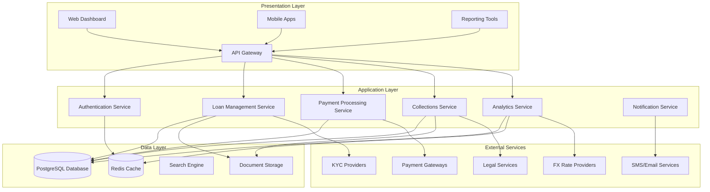
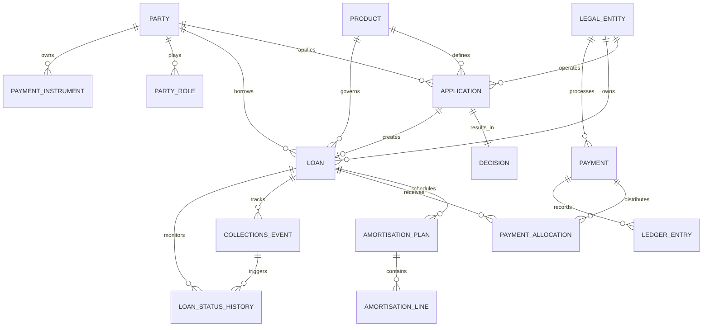
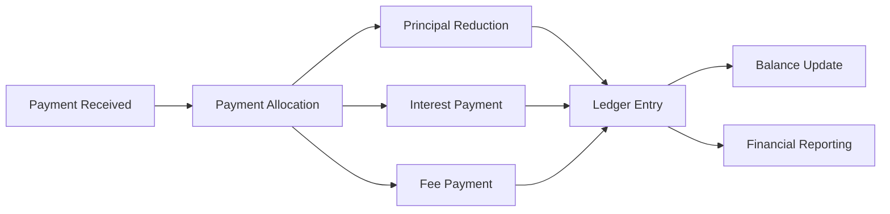
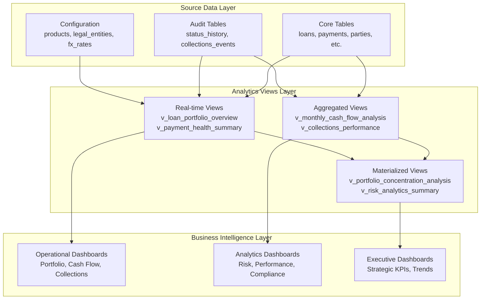
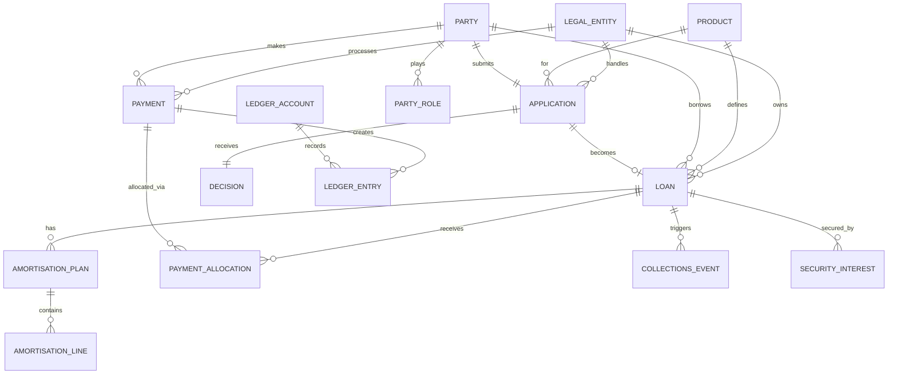
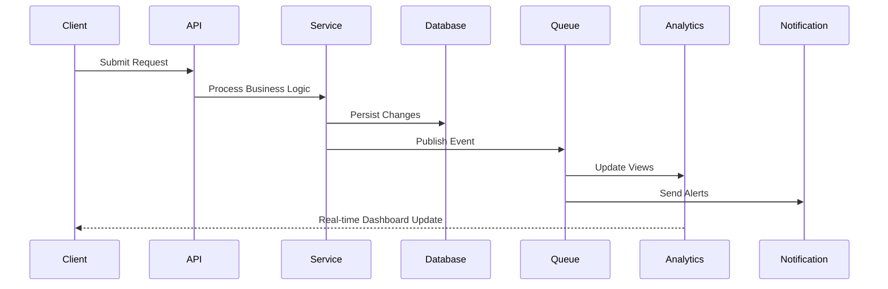
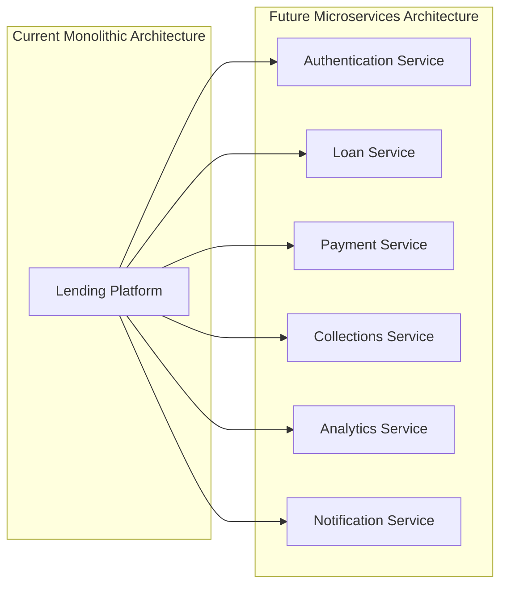

# Rently Lending Platform - Technical Architecture

**Version:** 1.0  
**Last Updated:** December 2024  
**Document Owner:** Engineering & Data Architecture Team

## Table of Contents
1. [Architecture Overview](#architecture-overview)
2. [Database Design Principles](#database-design-principles)
3. [System Components](#system-components)
4. [Database Architecture](#database-architecture)
5. [Data Flow Architecture](#data-flow-architecture)
6. [Analytics Architecture](#analytics-architecture)
7. [Security Architecture](#security-architecture)
8. [Performance Architecture](#performance-architecture)
9. [Integration Architecture](#integration-architecture)
10. [Deployment Architecture](#deployment-architecture)
11. [Monitoring and Observability](#monitoring-and-observability)
12. [Scalability Considerations](#scalability-considerations)

## Architecture Overview

The Rently Lending Platform is built on a modern, scalable architecture designed to support high-volume lending operations across multiple markets, currencies, and product lines. The system emphasizes data consistency, performance, security, and regulatory compliance.

### Core Design Principles

- **Data-Driven Architecture**: All business decisions supported by real-time analytics
- **Event-Driven Processing**: Asynchronous processing for scalability and reliability
- **Microservices Ready**: Modular design supporting future service decomposition
- **API-First Design**: RESTful APIs enabling integration and mobile support
- **Security by Design**: Multiple layers of security controls and audit trails
- **Multi-Tenant Capable**: Legal entity separation with shared infrastructure

### High-Level System Architecture



## Database Design Principles

### Core Design Philosophy

The Rently lending platform database architecture follows modern financial services best practices with emphasis on data integrity, auditability, and scalability.

#### 1. Data Integrity & Consistency
- **ACID Compliance**: Full PostgreSQL ACID transaction support
- **Referential Integrity**: Comprehensive foreign key constraints
- **Check Constraints**: Business rule validation at database level
- **Audit Trail**: Complete transaction history for regulatory compliance

#### 2. Multi-Tenancy Design
- **Legal Entity Separation**: Isolated data per legal entity
- **Shared Infrastructure**: Efficient resource utilization
- **Data Privacy**: Row-level security where required
- **Regulatory Compliance**: Entity-specific data retention policies

#### 3. Temporal Data Management
- **Effective Dating**: Time-based validity for rates, statuses, and roles
- **Audit Logging**: Complete change history with timestamps
- **Version Control**: Schema versioning for safe upgrades
- **Data Retention**: Configurable retention policies per entity type

### Database Schema Architecture



### Key Entity Relationships

#### Core Business Flow
1. **Application → Decision → Loan Creation**
2. **Payment Receipt → Allocation → Ledger Entry**
3. **Collections Event → Status Update → Recovery Action**
4. **Risk Assessment → Status History → Escalation**

#### Financial Transaction Flow


## System Components

### 1. Presentation Layer

#### Web Dashboard
- **Technology**: React/Vue.js with responsive design
- **Features**: 11 comprehensive dashboards, real-time updates, export capabilities
- **Users**: Executives, risk managers, operations staff, collections teams
- **Performance**: <3 second load time, support for 100+ concurrent users

## Analytics Architecture

### Analytics Layer Design

The analytics layer provides real-time insights and business intelligence through a structured approach to data aggregation, analysis, and presentation.



### Key Analytics Components

#### 1. Real-Time Analytics Views (Tier 1)
- **v_loan_portfolio_overview**: Live portfolio composition and health metrics
- **v_payment_health_summary**: Current payment status and early warning indicators  
- **v_dpd_analysis**: Days past due analysis with risk categorization
- **v_collections_performance**: Active collections efforts and recovery rates

#### 2. Aggregated Analytics Views (Tier 2)
- **v_weekly_cash_flow_projections**: 12-week forward cash flow forecasting
- **v_monthly_cash_flow_analysis**: Historical and projected cash flow analysis
- **v_payment_timing_analysis**: Payment behavior patterns and trends
- **v_currency_risk_analysis**: Multi-currency exposure and hedging analysis

#### 3. Materialized Views for Complex Analytics (Tier 3)
- **v_portfolio_concentration_analysis**: Multi-dimensional concentration risk
- **v_counterparty_risk_assessment**: Borrower risk scoring and segmentation
- **v_collections_resolution_analysis**: Collections effectiveness and optimization
- **v_executive_summary_dashboard**: High-level KPIs and trend analysis

### Dashboard Architecture

#### 11 Comprehensive Dashboards

1. **Loan Portfolio Overview Dashboard**
   - Real-time portfolio health monitoring
   - Product category and business unit analysis
   - Default rate tracking and early warning systems

2. **Cash Flow Management Dashboard**  
   - 12-week cash flow projections
   - Collection efficiency monitoring
   - Currency exposure analysis

3. **Collections Performance Dashboard**
   - Recovery rate optimization
   - Collections funnel analysis
   - Agent performance tracking

4. **Payment Health Metrics Dashboard**
   - DPD bucket analysis
   - Risk migration patterns
   - Early warning indicators

5. **Risk Analytics Dashboard**
   - Portfolio concentration analysis
   - Counterparty risk assessment
   - Currency and geographic risk monitoring

6. **Performance Metrics Dashboard**
   - Operational KPIs and benchmarks
   - Trend analysis and forecasting
   - Efficiency metrics

7. **Regulatory Compliance Dashboard**
   - Compliance monitoring and reporting
   - Regulatory ratio tracking
   - Audit trail verification

8. **Executive Summary Dashboard**
   - Strategic KPIs and business metrics
   - Board-level reporting
   - Trend analysis and insights

9. **Operational Excellence Dashboard**
   - Process efficiency monitoring
   - System performance metrics
   - Quality assurance tracking

10. **Customer Analytics Dashboard**
    - Customer behavior analysis
    - Segmentation and profiling
    - Lifetime value analysis

11. **Market Intelligence Dashboard**
    - Market trends and insights
    - Competitive analysis
    - Business opportunity identification

### Performance Optimization

#### Materialized View Refresh Strategy
- **Hourly Refresh**: Risk and portfolio concentration views
- **Daily Refresh**: Executive summary and compliance views  
- **Weekly Refresh**: Historical trend and market analysis views
- **Real-time Refresh**: Critical operational monitoring views

#### Query Performance Optimization
- **Strategic Indexing**: Optimized for dashboard query patterns
- **Partitioning**: Large tables partitioned by date/entity
- **Caching**: Frequent queries cached in Redis
- **Connection Pooling**: pgBouncer for connection management

#### Mobile Applications
- **Technology**: React Native or native iOS/Android
- **Features**: Loan status, payment history, document upload, notifications
- **Users**: Borrowers, field agents, collectors
- **Capabilities**: Offline mode, biometric authentication, push notifications

#### API Gateway
- **Technology**: Kong/AWS API Gateway with rate limiting
- **Features**: Authentication, authorization, rate limiting, API versioning
- **Security**: OAuth 2.0, JWT tokens, TLS encryption
- **Monitoring**: Request/response logging, performance metrics

### 2. Application Services

#### Authentication Service
- **Features**: Multi-factor authentication, role-based access control
- **Technology**: OAuth 2.0, SAML integration capability
- **Security**: Password policies, session management, audit logging
- **Integration**: LDAP/Active Directory support

#### Loan Management Service
- **Core Functions**: Application processing, loan origination, amortization planning
- **Business Logic**: Product rules, approval workflows, disbursement management
- **Data Management**: Loan lifecycle tracking, refinancing, transfers
- **Integration**: KYC services, document management, payment processing

#### Payment Processing Service
- **Functions**: Payment receipt, allocation, reconciliation
- **Features**: Multi-currency support, FX rate management, payment scheduling
- **Integration**: Multiple payment providers, banking APIs, wallet services
- **Processing**: Real-time payment allocation, batch reconciliation

#### Collections Service
- **Capabilities**: Automated workflows, escalation rules, legal action tracking
- **Features**: Multi-stage collections, payment arrangements, dispute management
- **Integration**: SMS/email providers, legal services, customer communication
- **Automation**: Rule-based escalation, performance tracking

#### Analytics Service
- **Functions**: Real-time metrics, predictive analytics, reporting
- **Technology**: PostgreSQL analytics views, caching layer
- **Features**: 50+ analytical views, materialized view management
- **Capabilities**: Data aggregation, trend analysis, forecasting

### 3. Data Layer

#### PostgreSQL Database
- **Version**: PostgreSQL 12+ with extensions
- **Schema**: 25+ tables with comprehensive relationships
- **Features**: ACID compliance, advanced indexing, materialized views
- **Performance**: Optimized for high-throughput OLTP and analytics
- **Backup**: Continuous archiving, point-in-time recovery

#### Redis Cache
- **Usage**: Session storage, frequent query caching, real-time data
- **Features**: High availability, data persistence, pub/sub messaging
- **Performance**: Sub-millisecond response times
- **Scalability**: Cluster mode for horizontal scaling

#### Document Storage
- **Technology**: S3-compatible storage with metadata indexing
- **Features**: Encryption at rest, versioning, lifecycle management
- **Integration**: Virus scanning, OCR processing, document workflows
- **Compliance**: Retention policies, audit trails, access logging

## Database Architecture

### Schema Design

The database follows a normalized design optimized for both transactional processing and analytical queries.

#### Core Entity Model



#### Enhanced Features (v1.0)

1. **Product Categorization**: Enhanced product taxonomy supporting business units
2. **Operational Status Tracking**: Loan status history with versioning
3. **Dispute Management**: Payment discrepancy resolution workflows
4. **Transfer Management**: Loan transfers, apartment changes, refinancing
5. **Rental-Specific Fields**: Lease periods, agent management, installment tracking

### Indexing Strategy

#### Primary Indexes
- **Clustered**: All tables use UUID primary keys with btree clustering
- **Foreign Key**: All foreign key relationships indexed for join performance
- **Business Key**: Unique business identifiers (loan numbers, application numbers)

#### Performance Indexes
```sql
-- High-frequency query optimization
CREATE INDEX CONCURRENTLY idx_loan_status_borrower ON loan(status, borrower_party_id);
CREATE INDEX CONCURRENTLY idx_payment_received_status ON payment(received_at, status);
CREATE INDEX CONCURRENTLY idx_collections_event_loan_dpd ON collections_event(loan_id, dpd_snapshot);

-- Analytics optimization
CREATE INDEX CONCURRENTLY idx_loan_start_date_product ON loan(start_date, product_id);
CREATE INDEX CONCURRENTLY idx_payment_allocation_component ON payment_allocation(component, allocated_amount);
```

#### Partial Indexes
```sql
-- Active records only
CREATE INDEX CONCURRENTLY idx_loan_active ON loan(status) WHERE status = 'active';
CREATE INDEX CONCURRENTLY idx_party_active ON party(is_active) WHERE is_active = true;
CREATE INDEX CONCURRENTLY idx_payment_pending ON payment(status) WHERE status = 'pending';
```

### Data Partitioning Strategy

#### Time-Based Partitioning
```sql
-- Large transaction tables partitioned by month
CREATE TABLE payment_y2024m01 PARTITION OF payment
    FOR VALUES FROM ('2024-01-01') TO ('2024-02-01');

CREATE TABLE ledger_entry_y2024m01 PARTITION OF ledger_entry
    FOR VALUES FROM ('2024-01-01') TO ('2024-02-01');
```

#### Range Partitioning
```sql
-- Collections events by DPD ranges
CREATE TABLE collections_event_current PARTITION OF collections_event
    FOR VALUES FROM (0) TO (31);
    
CREATE TABLE collections_event_overdue PARTITION OF collections_event
    FOR VALUES FROM (31) TO (91);
```

## Data Flow Architecture

### Event-Driven Processing

#### Event Types
- **Loan Events**: Application submitted, loan approved, loan closed
- **Payment Events**: Payment received, allocation completed, dispute raised
- **Collections Events**: Overdue detected, reminder sent, legal action initiated
- **System Events**: Data validation, reconciliation, backup completed

#### Event Processing Pipeline



### Data Processing Patterns

#### Real-Time Processing (Tier 1)
- **Latency**: <1 second for operational data
- **Use Cases**: Payment processing, collections alerts, dashboard updates
- **Technology**: Database triggers, change data capture, WebSocket updates

#### Near Real-Time Processing (Tier 2)
- **Latency**: 5-15 minutes for aggregated data
- **Use Cases**: Risk metrics, portfolio summaries, performance indicators
- **Technology**: Materialized view refresh, scheduled aggregations

#### Batch Processing (Tier 3)
- **Latency**: Hourly/daily for analytical data
- **Use Cases**: Regulatory reports, historical analysis, data warehouse updates
- **Technology**: Scheduled jobs, ETL pipelines, bulk data processing

### Analytics Architecture

#### Materialized Views Strategy

```sql
-- Real-time operational views
CREATE MATERIALIZED VIEW v_active_loans_summary AS
SELECT 
    product_id,
    COUNT(*) as active_count,
    SUM(principal_amount) as total_principal,
    AVG(interest_rate) as avg_rate
FROM loan 
WHERE status = 'active'
GROUP BY product_id;

-- Refresh every 5 minutes
SELECT cron.schedule('refresh-active-loans', '*/5 * * * *', 
    'REFRESH MATERIALIZED VIEW CONCURRENTLY v_active_loans_summary;');
```

#### View Hierarchy
1. **Base Views**: Direct table aggregations
2. **Composite Views**: Multi-table joins with business logic
3. **Dashboard Views**: Optimized for specific dashboard requirements
4. **Reporting Views**: Regulatory and compliance reporting formats

## Security Architecture

### Multi-Layer Security Model

#### 1. Network Security
- **TLS/SSL**: All communications encrypted in transit
- **VPN Access**: Secure remote access for administrators
- **Firewall Rules**: Network segmentation and access control
- **DDoS Protection**: Application-level DDoS mitigation

#### 2. Application Security
- **Authentication**: Multi-factor authentication required
- **Authorization**: Role-based access control (RBAC)
- **Session Management**: Secure session handling with timeout
- **Input Validation**: SQL injection and XSS prevention

#### 3. Database Security
- **Encryption at Rest**: AES-256 encryption for sensitive data
- **Row Level Security**: Data isolation by legal entity
- **Audit Logging**: Complete audit trail for all modifications
- **Backup Encryption**: Encrypted database backups

#### 4. Data Protection
- **PII Masking**: Sensitive data masked based on user roles
- **Data Classification**: Automatic classification of sensitive fields
- **Data Retention**: Automated data lifecycle management
- **GDPR Compliance**: Right to be forgotten implementation

### Security Implementation

#### Role-Based Access Control
```sql
-- Database roles aligned with business functions
CREATE ROLE rently_executive;
CREATE ROLE rently_risk_manager;
CREATE ROLE rently_collections_agent;
CREATE ROLE rently_readonly_analyst;

-- Granular permissions
GRANT SELECT ON ALL TABLES IN SCHEMA public TO rently_readonly_analyst;
GRANT SELECT, INSERT, UPDATE ON loan, payment, collections_event TO rently_collections_agent;
GRANT ALL PRIVILEGES ON ALL TABLES IN SCHEMA public TO rently_executive;
```

#### Data Masking
```sql
-- Dynamic data masking for sensitive fields
CREATE OR REPLACE VIEW v_party_masked AS
SELECT 
    id,
    kind,
    display_name,
    CASE 
        WHEN current_user_has_role('rently_executive') THEN email
        ELSE regexp_replace(email, '(.{2}).*@', '\1***@')
    END as email,
    CASE 
        WHEN current_user_has_role('rently_executive') THEN phone
        ELSE regexp_replace(phone, '(.{3}).*(.{2})', '\1***\2')
    END as phone
FROM party;
```

## Performance Architecture

### Performance Optimization Strategy

#### 1. Query Optimization
- **Index Usage**: Comprehensive indexing strategy for all query patterns
- **Query Planning**: Regular analysis and optimization of execution plans
- **Statistics Updates**: Automated table statistics refresh
- **Hint Usage**: Query hints for complex analytical queries

#### 2. Connection Management
- **Connection Pooling**: pgBouncer for connection multiplexing
- **Connection Limits**: Configured limits preventing resource exhaustion
- **Load Balancing**: Read replicas for analytical workloads
- **Connection Monitoring**: Real-time connection usage tracking

#### 3. Caching Strategy
- **Application Cache**: Redis for frequently accessed data
- **Query Result Cache**: Materialized views for expensive queries
- **Object Cache**: Caching of calculated values and aggregations
- **Cache Invalidation**: Event-driven cache refresh

#### 4. Hardware Optimization
- **Storage**: SSD storage for optimal I/O performance
- **Memory**: Adequate buffer pool sizing for working set
- **CPU**: Multi-core processing for parallel query execution
- **Network**: High-bandwidth network for data transfer

### Performance Monitoring

#### Key Performance Indicators
- **Response Time**: <3 seconds for dashboard queries
- **Throughput**: 10,000+ transactions per hour
- **Availability**: 99.9% uptime target
- **Concurrency**: 100+ concurrent users supported

#### Monitoring Tools
```sql
-- Performance monitoring views
CREATE VIEW v_slow_queries AS
SELECT 
    query,
    calls,
    total_time,
    mean_time,
    rows
FROM pg_stat_statements 
WHERE mean_time > 1000
ORDER BY mean_time DESC;

-- Real-time performance dashboard
CREATE VIEW v_performance_metrics AS
SELECT 
    'Active Connections' as metric,
    count(*) as value
FROM pg_stat_activity
WHERE state = 'active'
UNION ALL
SELECT 
    'Slow Queries (>1s)',
    count(*)
FROM pg_stat_statements
WHERE mean_time > 1000;
```

## Integration Architecture

### External System Integration

#### 1. Payment Provider Integration
- **Multiple Providers**: Support for various payment gateways
- **Standardized Interface**: Common API for all payment providers
- **Failover Capability**: Automatic failover between providers
- **Reconciliation**: Automated payment reconciliation processes

#### 2. KYC Service Integration
- **Document Verification**: Automated document processing
- **Identity Verification**: Real-time identity checks
- **Risk Assessment**: Integration with risk scoring services
- **Compliance**: Automated compliance checking

#### 3. FX Rate Integration
- **Multiple Sources**: Redundant FX rate providers
- **Real-time Updates**: Continuous rate updates
- **Historical Data**: Complete historical rate archive
- **Rate Validation**: Cross-provider rate validation

### API Design

#### RESTful API Standards
- **HTTP Methods**: Proper use of GET, POST, PUT, DELETE
- **Status Codes**: Standard HTTP status code usage
- **Content Types**: JSON for data exchange, proper headers
- **Versioning**: URL-based API versioning

#### API Security
- **OAuth 2.0**: Industry standard authentication
- **Rate Limiting**: Request rate limiting per client
- **API Keys**: Secure API key management
- **Request Logging**: Complete request/response logging

## Deployment Architecture

### Environment Strategy

#### Development Environment
- **Purpose**: Feature development and unit testing
- **Configuration**: Single-node deployment with test data
- **Database**: PostgreSQL with development settings
- **Monitoring**: Basic monitoring and logging

#### Staging Environment
- **Purpose**: Integration testing and user acceptance testing
- **Configuration**: Production-like environment with sanitized data
- **Database**: PostgreSQL replica of production structure
- **Monitoring**: Full monitoring stack deployed

#### Production Environment
- **Purpose**: Live system serving customers
- **Configuration**: High availability, fault-tolerant deployment
- **Database**: PostgreSQL with read replicas and backup
- **Monitoring**: Comprehensive monitoring and alerting

### Deployment Patterns

#### Blue-Green Deployment
```bash
# Deploy to green environment
kubectl apply -f k8s/green/
kubectl set env deployment/rently-app ENVIRONMENT=green

# Test green environment
kubectl run test-pod --image=test-runner --env="TARGET=green"

# Switch traffic to green
kubectl patch service rently-service -p '{"spec":{"selector":{"version":"green"}}}'

# Cleanup blue environment
kubectl delete -f k8s/blue/
```

#### Rolling Updates
```bash
# Rolling update with zero downtime
kubectl set image deployment/rently-app app=rently-app:v2.0.0
kubectl rollout status deployment/rently-app

# Rollback if issues detected
kubectl rollout undo deployment/rently-app
```

### Infrastructure as Code

#### Kubernetes Manifests
```yaml
apiVersion: apps/v1
kind: Deployment
metadata:
  name: rently-lending-app
spec:
  replicas: 3
  selector:
    matchLabels:
      app: rently-lending
  template:
    metadata:
      labels:
        app: rently-lending
    spec:
      containers:
      - name: app
        image: rently/lending-platform:v1.0.0
        ports:
        - containerPort: 8080
        env:
        - name: DATABASE_URL
          valueFrom:
            secretKeyRef:
              name: db-secret
              key: url
```

#### Database Configuration
```bash
# PostgreSQL production configuration
shared_preload_libraries = 'pg_stat_statements,auto_explain'
max_connections = 200
shared_buffers = 4GB
effective_cache_size = 12GB
checkpoint_completion_target = 0.9
wal_buffers = 16MB
default_statistics_target = 100
random_page_cost = 1.1
work_mem = 64MB
```

## Monitoring and Observability

### Monitoring Stack

#### Application Monitoring
- **Metrics**: Custom business metrics, performance counters
- **Logging**: Structured logging with correlation IDs
- **Tracing**: Distributed tracing for request flows
- **Alerting**: Proactive alerting on anomalies

#### Database Monitoring
- **Performance**: Query performance, connection utilization
- **Health**: Database health checks, replication lag
- **Capacity**: Storage usage, growth trends
- **Security**: Failed login attempts, privilege escalations

#### Infrastructure Monitoring
- **Resources**: CPU, memory, disk, network utilization
- **Services**: Service health, dependency monitoring
- **Availability**: Uptime monitoring, response time tracking
- **Security**: Intrusion detection, anomaly detection

### Observability Implementation

#### Metrics Collection
```sql
-- Custom business metrics
CREATE OR REPLACE FUNCTION collect_business_metrics()
RETURNS TABLE(metric_name TEXT, metric_value NUMERIC, timestamp TIMESTAMPTZ)
AS $$
BEGIN
    RETURN QUERY
    SELECT 'active_loans_count', count(*)::numeric, now()
    FROM loan WHERE status = 'active'
    UNION ALL
    SELECT 'total_portfolio_value', sum(principal_amount), now()
    FROM loan WHERE status = 'active'
    UNION ALL
    SELECT 'default_rate_percent', 
           (count(*) FILTER (WHERE status IN ('defaulted', 'written_off'))::numeric / 
            count(*)::numeric * 100), now()
    FROM loan;
END;
$$ LANGUAGE plpgsql;
```

#### Health Check Endpoints
```sql
-- System health check function
CREATE OR REPLACE FUNCTION system_health_check()
RETURNS JSON AS $$
DECLARE
    result JSON;
BEGIN
    SELECT json_build_object(
        'database_status', 'healthy',
        'connection_count', (SELECT count(*) FROM pg_stat_activity),
        'last_backup', (SELECT max(backup_finish_time) FROM backup_history),
        'replication_lag', pg_last_wal_receive_lsn() - pg_last_wal_replay_lsn(),
        'timestamp', now()
    ) INTO result;
    
    RETURN result;
END;
$$ LANGUAGE plpgsql;
```

#### Alerting Rules
```yaml
# Prometheus alerting rules
groups:
- name: rently-lending
  rules:
  - alert: HighDatabaseConnections
    expr: pg_stat_database_numbackends > 150
    for: 5m
    labels:
      severity: warning
    annotations:
      summary: High database connection count
      
  - alert: SlowQueryDetected
    expr: pg_stat_statements_mean_time_ms > 5000
    for: 1m
    labels:
      severity: critical
    annotations:
      summary: Slow query detected in database
```

## Scalability Considerations

### Horizontal Scaling

#### Database Scaling
- **Read Replicas**: Multiple read replicas for analytical workloads
- **Partitioning**: Table partitioning for large datasets
- **Sharding**: Future sharding strategy for extreme scale
- **Connection Pooling**: Connection multiplexing for efficiency

#### Application Scaling
- **Microservices**: Service decomposition for independent scaling
- **Container Orchestration**: Kubernetes for dynamic scaling
- **Load Balancing**: Traffic distribution across instances
- **Caching**: Distributed caching for performance

### Vertical Scaling

#### Database Server Scaling
- **CPU Scaling**: Multi-core processors for parallel processing
- **Memory Scaling**: Large memory pools for caching
- **Storage Scaling**: High-performance SSD arrays
- **Network Scaling**: High-bandwidth network interfaces

#### Application Server Scaling
- **Instance Sizing**: Right-sizing based on workload patterns
- **Resource Allocation**: Dynamic resource allocation
- **Performance Tuning**: JVM/runtime optimization
- **Monitoring**: Resource utilization monitoring

### Future Architecture Evolution

#### Microservices Migration


#### Cloud-Native Evolution
- **Container Orchestration**: Kubernetes for service management
- **Service Mesh**: Istio for service-to-service communication
- **Event Streaming**: Kafka for event-driven architecture
- **Serverless Functions**: Lambda functions for event processing

#### Advanced Analytics
- **Data Lake**: S3-based data lake for historical analysis
- **Machine Learning**: ML pipelines for predictive analytics
- **Stream Processing**: Real-time stream processing for events
- **Graph Database**: Neo4j for relationship analysis

---

This architecture documentation provides a comprehensive overview of the Rently Lending Platform's technical design. For implementation details, refer to the specific configuration files and deployment scripts included in the project repository.