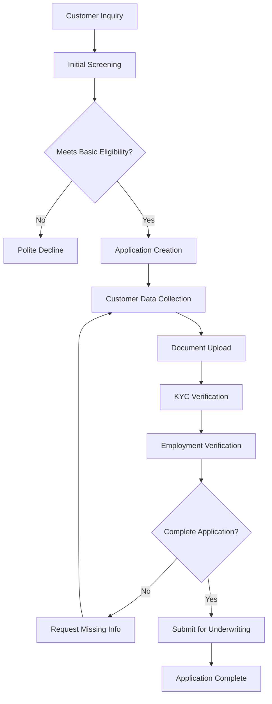
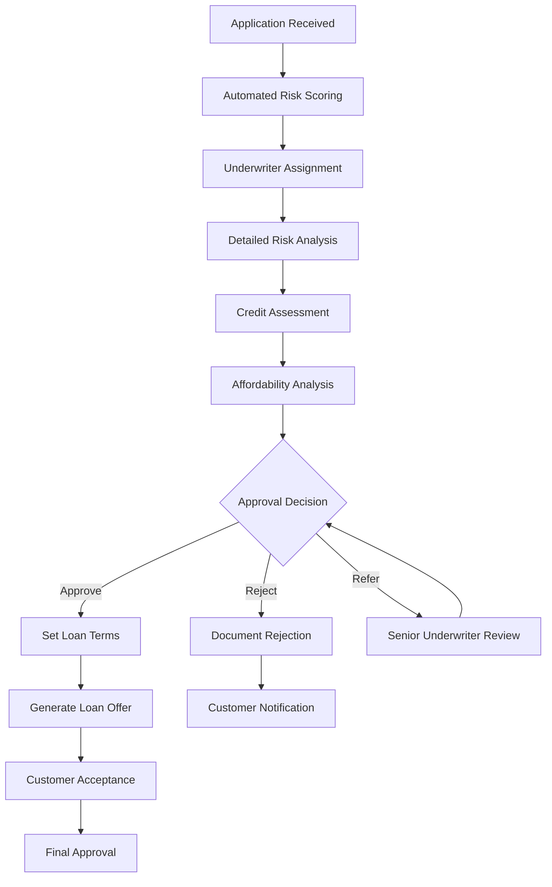
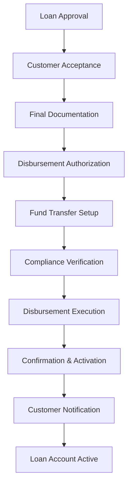
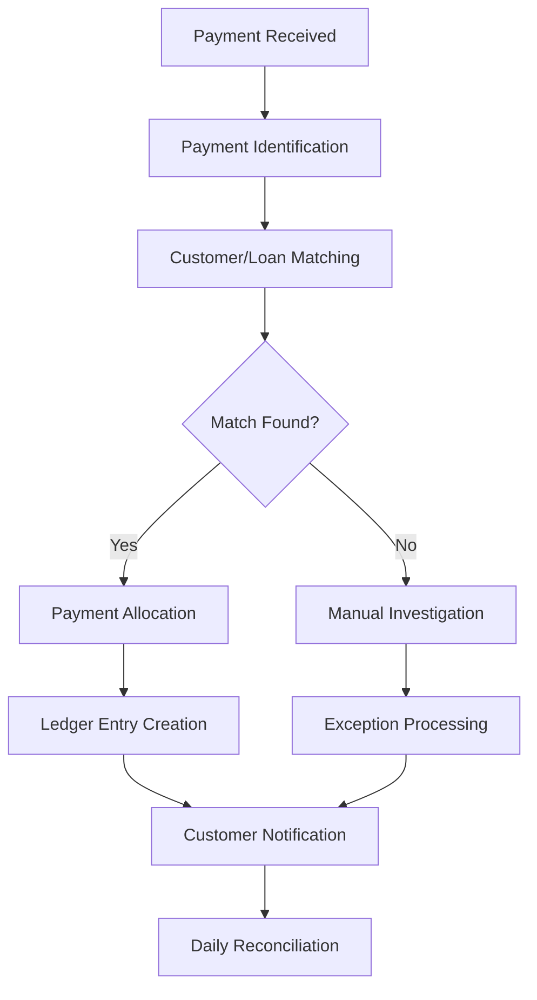
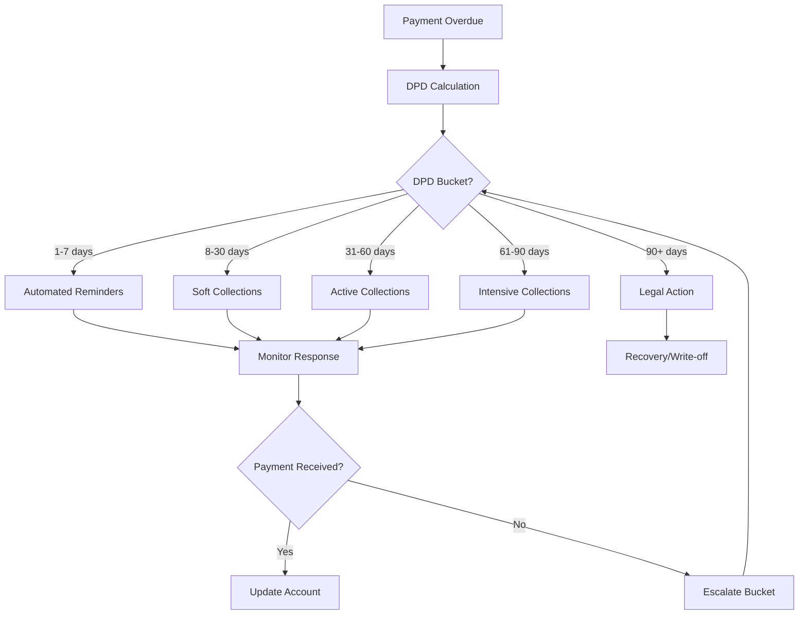

# Business Processes Documentation - Rently Lending Platform

## Table of Contents

1. [Overview](#overview)
2. [Loan Application Process](#loan-application-process)
3. [Underwriting and Approval Process](#underwriting-and-approval-process)
4. [Loan Disbursement Process](#loan-disbursement-process)
5. [Payment Processing Workflow](#payment-processing-workflow)
6. [Collections and Recovery Process](#collections-and-recovery-process)
7. [Default Management Process](#default-management-process)
8. [Customer Service Processes](#customer-service-processes)
9. [Compliance and Audit Processes](#compliance-and-audit-processes)
10. [Exception Handling Procedures](#exception-handling-procedures)

---

## Overview

### Process Framework
The Rently Lending Platform operates on a structured workflow system that ensures consistent, compliant, and efficient loan processing from application to closure. All processes are designed with built-in controls, audit trails, and escalation mechanisms.

### Key Process Principles
- **Customer-Centric**: All processes prioritize customer experience and satisfaction
- **Risk-Managed**: Each step incorporates appropriate risk controls and assessments
- **Compliant**: Processes ensure regulatory compliance and audit readiness
- **Efficient**: Workflows are optimized for speed without compromising quality
- **Transparent**: Clear communication and status tracking throughout all processes

### Process Categories

| Process Category | SLA | Owner | Frequency |
|------------------|-----|-------|-----------|
| **Application Processing** | 1-5 business days | Loan Officers | Continuous |
| **Underwriting** | 24-48 hours | Underwriters | Daily |
| **Disbursement** | 2-4 hours | Finance Team | Daily |
| **Payment Processing** | 24 hours | Operations | Daily |
| **Collections** | Ongoing | Collections Team | Daily |
| **Reporting** | Daily/Monthly | All Departments | Scheduled |

---

## Loan Application Process

### Process Overview
The loan application process transforms customer inquiries into complete loan applications ready for underwriting review. This process ensures all necessary information and documentation are collected efficiently.

### Process Flow

### Detailed Process Steps

#### Step 1: Customer Inquiry and Initial Screening
**Duration**: 15-30 minutes  
**Responsible**: Loan Officer / Customer Service

**Activities**:
1. **Customer Contact**:
   - Receive inquiry via phone, email, or walk-in
   - Record customer contact information
   - Understand loan purpose and requirements

2. **Initial Eligibility Check**:
   - Verify basic eligibility criteria (age, residency, income)
   - Explain product options and terms
   - Assess customer's ability to provide required documentation

3. **Product Selection**:
   - Recommend appropriate loan product based on needs
   - Explain features, benefits, and requirements
   - Provide initial loan amount and term estimates

**Outputs**:
- Customer contact record
- Product recommendation
- Preliminary eligibility assessment

#### Step 2: Application Creation and Data Collection
**Duration**: 45-90 minutes  
**Responsible**: Loan Officer

**Activities**:
1. **Application Setup**:
   - Create new application record in system
   - Assign unique application ID
   - Set application type and product category

2. **Personal Information Collection**:
   - Full name and identification details
   - Contact information (phone, email, address)
   - Emergency contact information
   - Demographic information as required

3. **Employment and Income Details**:
   - Current employer information
   - Job title and employment duration
   - Monthly income and additional income sources
   - Bank account details for salary transfer

4. **Financial Information**:
   - Monthly expenses and commitments
   - Existing loans and credit facilities
   - Assets owned (property, vehicles, investments)
   - Financial references

**Quality Controls**:
- Data validation rules applied automatically
- Cross-verification of critical information
- Completeness checks before progression

#### Step 3: Documentation Collection and Verification
**Duration**: 1-3 business days  
**Responsible**: Loan Officer / Document Team

**Required Documents by Product**:

##### Rently Care D2C
- Emirates ID (front and back)
- Salary certificate (not older than 3 months)
- Bank statements (last 3 months)
- Tenancy contract (if applicable)
- No objection certificate from employer

##### Rently Care Collaborative
- Emirates ID (front and back)
- Salary certificate with salary details
- Bank statements (last 6 months)
- Employment contract
- Guarantor documents (if applicable)
- Property-related documents

##### B2B SME
- Trade license and establishment card
- Audited financial statements (2 years)
- Bank statements (12 months)
- Tax registration certificates
- Business plan and cash flow projections
- Directors' Emirates IDs and financial statements
- Insurance policies

##### RNPL UAE
- Emirates ID or passport with visa
- Salary certificate or income proof
- Bank statements (last 3 months)
- Mobile phone bill (for contact verification)

**Document Processing**:
1. **Upload and Categorization**:
   - Documents uploaded to secure document management system
   - Automatic categorization by document type
   - Version control for document updates

2. **Verification Process**:
   - Document authenticity checks
   - Information consistency validation
   - Third-party verification where required
   - Flagging of any discrepancies

3. **Completeness Assessment**:
   - Check against product-specific requirements
   - Identify missing documents
   - Request additional documentation if needed

#### Step 4: KYC and AML Verification
**Duration**: 24-48 hours  
**Responsible**: Compliance Team / KYC Specialist

**Verification Activities**:
1. **Identity Verification**:
   - Government ID verification through official channels
   - Address verification through utility bills or bank statements
   - Employment verification through employer contact
   - Income verification through salary certificates and bank statements

2. **AML Screening**:
   - Sanctions list screening (OFAC, EU, UN lists)
   - Politically Exposed Person (PEP) screening
   - Adverse media screening
   - Internal blacklist checks

3. **Credit Bureau Checks**:
   - Credit history retrieval from authorized bureaus
   - Credit score analysis
   - Existing debt verification
   - Payment behavior assessment

**Risk Assessment**:
- Risk category assignment (Low, Medium, High)
- Enhanced due diligence for high-risk customers
- Approval requirements based on risk level

#### Step 5: Application Completion and Submission
**Duration**: 2-4 hours  
**Responsible**: Loan Officer

**Final Review Activities**:
1. **Application Completeness Check**:
   - Verify all required information collected
   - Ensure all documents are uploaded and verified
   - Confirm KYC and AML checks completed satisfactorily

2. **Data Quality Validation**:
   - Cross-check information consistency
   - Verify calculation accuracy
   - Ensure data integrity across all fields

3. **Submission Preparation**:
   - Generate application summary
   - Prepare underwriting package
   - Set appropriate urgency flags
   - Assign to appropriate underwriter

**Application Status Updates**:
- Customer notification of completion
- SMS/email confirmation with application ID
- Expected timeline communication
- Next steps explanation

### Process Controls and Quality Assurance

#### Quality Checkpoints
1. **Initial Screening**: Basic eligibility verification
2. **Data Collection**: Information accuracy and completeness
3. **Document Verification**: Authenticity and validity
4. **KYC Completion**: Risk assessment and compliance
5. **Final Review**: Overall application quality

#### Exception Handling
- **Incomplete Information**: Clear communication with customer on missing items
- **Document Issues**: Request for replacement or additional documentation
- **KYC Failures**: Enhanced due diligence or application decline
- **System Errors**: Manual processing with supervisor approval

---

## Underwriting and Approval Process

### Process Overview
The underwriting process evaluates loan applications for credit risk, determines approval decisions, and sets final loan terms. This process combines automated risk assessment with human expertise.

### Process Flow

### Detailed Process Steps

#### Step 1: Application Receipt and Initial Assessment
**Duration**: 2-4 hours  
**Responsible**: Underwriting Team Lead

**Activities**:
1. **Application Intake**:
   - Receive complete application from loan processing
   - Verify application completeness
   - Check KYC and documentation status
   - Assign priority based on product type and customer segment

2. **Automated Pre-Screening**:
   - Run automated eligibility checks
   - Generate initial risk score
   - Identify policy exceptions
   - Flag high-risk indicators

3. **Underwriter Assignment**:
   - Assign based on product expertise
   - Consider workload balancing
   - Match experience level to application complexity
   - Set target completion timeline

#### Step 2: Comprehensive Risk Assessment
**Duration**: 4-8 hours  
**Responsible**: Underwriter

**Credit Analysis Components**:

##### Financial Assessment
1. **Income Analysis**:
   - Verify income sources and stability
   - Assess income trends over time
   - Consider seasonal variations
   - Evaluate income quality and sustainability

2. **Expense Analysis**:
   - Review living expenses and commitments
   - Assess existing debt obligations
   - Calculate debt-to-income ratios
   - Consider family circumstances

3. **Affordability Calculation**:
   - Apply stress testing to income
   - Consider potential income changes
   - Assess repayment capacity under adverse scenarios
   - Ensure sustainable debt service

##### Credit History Evaluation
1. **Credit Bureau Analysis**:
   - Review credit report details
   - Analyze payment patterns
   - Assess credit utilization
   - Consider credit mix and experience

2. **Banking Relationship Review**:
   - Evaluate banking behavior
   - Review account maintenance patterns
   - Assess overdraft usage
   - Consider savings behavior

3. **Historical Performance**:
   - Review any previous Rently relationships
   - Analyze payment performance with other lenders
   - Consider credit defaults or restructuring
   - Evaluate resolution of past issues

##### Character and Stability Assessment
1. **Employment Stability**:
   - Assess employment history and stability
   - Consider industry and employer stability
   - Evaluate career progression
   - Review employment contract terms

2. **Residential Stability**:
   - Review residential history
   - Consider housing costs relative to income
   - Assess community ties
   - Evaluate contact accessibility

#### Step 3: Product-Specific Underwriting Criteria

##### Rently Care D2C Underwriting
**Key Criteria**:
- Minimum income: AED 5,000/month
- Maximum DTI: 50%
- Minimum employment: 6 months
- Clear credit history (minor issues acceptable)
- UAE residence with valid Emirates ID

**Risk Factors**:
- Recent employment changes
- High existing debt levels
- Previous payment defaults
- Irregular income patterns

**Approval Guidelines**:
- Auto-approve: Score >700, DTI <30%, stable employment
- Manual review: Score 600-700, DTI 30-50%
- Decline: Score <600, DTI >50%, major credit issues

##### Rently Care Collaborative Underwriting
**Enhanced Criteria**:
- Minimum income: AED 10,000/month
- Maximum DTI: 40%
- Minimum employment: 12 months
- Good credit history required
- Guarantor required for amounts >AED 50,000

**Additional Analysis**:
- Guarantor financial assessment
- Security evaluation if applicable
- Relationship analysis (borrower-guarantor)
- Enhanced affordability stress testing

##### B2B SME Underwriting
**Business Analysis**:
- Minimum 2 years in business
- Annual revenue >USD 100,000
- Positive cash flow trends
- Industry analysis and outlook
- Management experience and capability

**Financial Analysis**:
- Detailed financial statement analysis
- Cash flow projections
- Debt service coverage ratios
- Working capital analysis
- Collateral evaluation

**Risk Mitigation**:
- Personal guarantees from directors
- Collateral requirements
- Financial covenants
- Regular monitoring requirements

##### RNPL UAE Underwriting
**Streamlined Criteria**:
- Alternative data sources
- Real-time decision making
- Behavioral analytics
- Social media verification
- Mobile data analysis

**Risk Controls**:
- Lower exposure limits
- Shorter repayment terms
- Real-time monitoring
- Immediate escalation triggers

#### Step 4: Decision Making Process

##### Approval Authority Matrix
| Loan Amount | Regular Cases | Exception Cases |
|-------------|---------------|-----------------|
| Up to AED 25,000 | Senior Underwriter | Underwriting Manager |
| AED 25,001 - 50,000 | Underwriting Manager | Credit Committee |
| AED 50,001 - 100,000 | Credit Committee | Senior Management |
| Above AED 100,000 | Senior Management | Board Sub-Committee |

##### Decision Outcomes

**Approval**:
1. Set final loan amount and terms
2. Determine interest rate based on risk
3. Set any special conditions
4. Generate loan offer document
5. Communicate approval to customer

**Conditional Approval**:
1. Specify conditions to be met
2. Set timeline for condition fulfillment
3. Communicate requirements to customer
4. Schedule follow-up review

**Rejection**:
1. Document specific rejection reasons
2. Ensure regulatory compliance in communication
3. Provide constructive feedback where appropriate
4. Offer alternative products if suitable
5. Maintain professional customer relationship

#### Step 5: Loan Terms Setting

##### Interest Rate Determination
**Risk-Based Pricing Model**:
- Base rate plus risk premium
- Product-specific rate ranges
- Market conditions adjustment
- Customer relationship discounts
- Competitive positioning

**Fee Structure Confirmation**:
- Processing fees
- Ongoing service fees
- Late payment penalties
- Early settlement terms
- Other applicable charges

##### Loan Structure Design
**Repayment Schedule**:
- Payment frequency selection
- Payment amount calculation
- Due date assignment
- Grace period terms
- Modification provisions

**Security Requirements**:
- Collateral specifications
- Guarantor requirements
- Insurance requirements
- Legal documentation needs
- Registration requirements

### Quality Assurance and Controls

#### Internal Controls
1. **Four-Eyes Principle**: All approvals require secondary review
2. **Authority Limits**: Clear delegation of authority
3. **Policy Compliance**: Automated policy checks
4. **Documentation**: Complete decision rationale
5. **Audit Trail**: Full decision history maintained

#### Risk Monitoring
1. **Portfolio Concentration**: Limits by segment, industry, geography
2. **Vintage Analysis**: Performance tracking by approval period
3. **Exception Reporting**: Policy override tracking
4. **Performance Metrics**: Approval rates, default rates, profitability

---

## Loan Disbursement Process

### Process Overview
The disbursement process ensures approved loans are funded accurately and securely to customers while maintaining all necessary controls and documentation.

### Process Flow

### Detailed Process Steps

#### Step 1: Post-Approval Documentation
**Duration**: 2-24 hours  
**Responsible**: Loan Documentation Team

**Document Preparation**:
1. **Loan Agreement Generation**:
   - Incorporate approved terms and conditions
   - Include payment schedule
   - Add product-specific clauses
   - Ensure regulatory compliance

2. **Supporting Documents**:
   - Payment authorization forms
   - Direct debit mandates
   - Insurance requirements
   - Security documentation

3. **Customer Communication**:
   - Send loan offer and documents
   - Explain terms and conditions
   - Schedule signing appointment
   - Confirm customer acceptance

#### Step 2: Customer Acceptance and Documentation
**Duration**: 1-3 business days  
**Responsible**: Customer Service / Loan Officer

**Acceptance Process**:
1. **Document Review with Customer**:
   - Explain all terms and conditions
   - Review payment obligations
   - Clarify fees and charges
   - Address customer questions

2. **Document Execution**:
   - Obtain customer signatures
   - Witness signatures as required
   - Complete guarantor documentation
   - Finalize security documentation

3. **Verification Checks**:
   - Verify identity at signing
   - Confirm bank account details
   - Update contact information
   - Complete final KYC checks

#### Step 3: Pre-Disbursement Verification
**Duration**: 2-4 hours  
**Responsible**: Finance Operations Team

**Final Checks**:
1. **Documentation Completeness**:
   - All required signatures obtained
   - Legal documentation completed
   - Insurance policies in place
   - Security interests properly registered

2. **System Setup**:
   - Loan account creation
   - Amortization schedule generation
   - Payment setup configuration
   - Account linking completion

3. **Compliance Verification**:
   - Final AML checks
   - Sanction list re-screening
   - Regulatory reporting preparation
   - Risk limit verification

#### Step 4: Disbursement Execution
**Duration**: 1-2 hours  
**Responsible**: Finance Team / Treasury

**Fund Transfer Process**:
1. **Payment Instruction Creation**:
   - Prepare payment instruction
   - Verify beneficiary details
   - Confirm payment amount
   - Set payment priority

2. **Authorization Process**:
   - First approver verification
   - Second approver confirmation
   - Treasury approval (if required)
   - System authorization codes

3. **Payment Execution**:
   - Initiate bank transfer
   - Monitor payment status
   - Handle any transfer issues
   - Confirm payment completion

#### Step 5: Post-Disbursement Activities
**Duration**: 2-4 hours  
**Responsible**: Loan Servicing Team

**Account Activation**:
1. **System Updates**:
   - Activate loan account
   - Update customer records
   - Generate payment schedule
   - Set up automatic notifications

2. **Customer Communication**:
   - Send disbursement confirmation
   - Provide payment schedule
   - Share account access details
   - Explain servicing procedures

3. **Handover to Servicing**:
   - Transfer to loan servicing team
   - Update customer relationship records
   - Set monitoring parameters
   - Schedule first payment reminder

### Disbursement Controls and Verification

#### Financial Controls
1. **Dual Authorization**: All disbursements require two approvals
2. **Amount Verification**: Cross-check against approved amount
3. **Account Verification**: Confirm beneficiary account details
4. **Cut-off Times**: Adherence to banking cut-off times
5. **Reconciliation**: Daily disbursement reconciliation

#### Compliance Controls
1. **Sanction Screening**: Final AML checks before disbursement
2. **Regulatory Reporting**: Transaction reporting as required
3. **Documentation**: Complete audit trail maintenance
4. **Risk Limits**: Adherence to concentration limits
5. **Approval Authority**: Verification of approval authority

---

## Payment Processing Workflow

### Process Overview
The payment processing workflow manages all customer payments from receipt through allocation to loan accounts, ensuring accurate and timely processing with comprehensive reconciliation.

### Process Flow

### Detailed Process Steps

#### Step 1: Payment Receipt and Identification
**Duration**: Real-time to 24 hours  
**Responsible**: Payment Operations Team

**Payment Channels**:

##### Electronic Payments
1. **Bank Transfers**:
   - Receive payment notifications from banks
   - Extract payment details and references
   - Match against expected payments
   - Process same-day if received before cut-off

2. **Card Payments**:
   - Real-time processing through payment gateway
   - Immediate confirmation to customer
   - Automatic system update
   - Exception handling for failed payments

3. **Digital Wallet Payments**:
   - API integration with wallet providers
   - Real-time payment confirmation
   - Automatic reconciliation
   - Fraud detection screening

##### Traditional Payments
1. **Cash Payments**:
   - Collection through authorized agents
   - Manual receipt generation
   - Same-day deposit to bank account
   - Agent reconciliation process

2. **Cheque Payments**:
   - Physical cheque deposit
   - Clearing period management
   - Return handling procedures
   - Customer notification system

#### Step 2: Payment Matching and Allocation
**Duration**: Real-time to 4 hours  
**Responsible**: Payment Processing Team

**Automatic Matching**:
1. **Reference Number Matching**:
   - Use loan ID or customer ID in payment reference
   - Automatic system matching
   - Instant payment allocation
   - Exception flagging for mismatches

2. **Amount and Timing Matching**:
   - Match expected payment amounts
   - Consider payment timing patterns
   - Account for partial payments
   - Handle overpayments appropriately

**Payment Allocation Hierarchy**:
1. **Outstanding Penalties**: Late fees and legal costs
2. **Service Charges**: RC fees and ongoing charges
3. **Accrued Interest**: Interest charges due
4. **Principal Amount**: Outstanding loan balance
5. **Advance Payments**: Future payment credits

#### Step 3: Exception Handling and Resolution
**Duration**: 4-24 hours  
**Responsible**: Payment Operations Specialists

**Common Exceptions**:

##### Unidentified Payments
1. **Investigation Process**:
   - Review payment details and timing
   - Search customer database by name/account
   - Contact originating bank for additional details
   - Review recent payment patterns

2. **Resolution Actions**:
   - Contact customer for clarification
   - Manual allocation once identified
   - Return payment if unidentifiable
   - Update customer records for future reference

##### Duplicate Payments
1. **Detection Methods**:
   - Automated duplicate detection algorithms
   - Amount and timing analysis
   - Customer payment pattern review
   - Bank statement cross-referencing

2. **Resolution Process**:
   - Verify actual duplicate payment
   - Determine correct allocation
   - Process refund if appropriate
   - Update customer account and notify

##### Payment Disputes
1. **Dispute Types**:
   - Amount discrepancies
   - Allocation disagreements
   - Timing issues
   - Unauthorized payments

2. **Investigation Procedure**:
   - Gather payment evidence
   - Review customer account history
   - Contact payment provider if needed
   - Document findings and resolution

#### Step 4: Reconciliation and Reporting
**Duration**: Daily processing  
**Responsible**: Finance Operations Team

**Daily Reconciliation**:
1. **Payment Summary Preparation**:
   - Total payments by channel
   - Currency breakdown
   - Exception summary
   - Outstanding items listing

2. **Bank Reconciliation**:
   - Match bank statements with system records
   - Identify discrepancies
   - Resolve timing differences
   - Update cash position

3. **Customer Account Updates**:
   - Ensure all payments properly allocated
   - Update payment history
   - Generate customer statements
   - Process payment confirmations

### Payment Processing Controls

#### Operational Controls
1. **Dual Verification**: Manual payments verified by two staff members
2. **System Validation**: Automatic validation rules for all payments
3. **Exception Reporting**: Daily exception reports and resolution tracking
4. **Audit Trail**: Complete payment processing history
5. **Segregation of Duties**: Clear separation between processing and approval

#### Financial Controls
1. **Daily Reconciliation**: Bank and system reconciliation
2. **Cash Management**: Optimal cash positioning and management
3. **Foreign Exchange**: Appropriate FX rate application
4. **Revenue Recognition**: Proper accounting treatment
5. **Regulatory Reporting**: Compliance with reporting requirements

---

## Collections and Recovery Process

### Process Overview
The collections process manages overdue accounts through systematic recovery activities, from initial contact through legal action, maximizing recovery while maintaining customer relationships.

### Collections Strategy Framework

#### Collection Buckets and Actions
| DPD Range | Classification | Actions | Responsible Team |
|-----------|----------------|---------|------------------|
| 1-7 days | Early Delinquency | Automated reminders | System |
| 8-30 days | Soft Collections | Personal contact, SMS | Customer Service |
| 31-60 days | Active Collections | Phone calls, emails | Collections Team |
| 61-90 days | Intensive Collections | Field visits, demand letters | Senior Collections |
| 90+ days | Legal Collections | Legal action, asset recovery | Legal Team |

### Process Flow

### Detailed Collections Processes

#### Phase 1: Early Delinquency (DPD 1-7)
**Objective**: Prompt customer awareness and quick resolution
**Duration**: 7 days
**Responsible**: Automated System

**Activities**:
1. **Day 1 - Immediate Reminder**:
   - SMS notification about missed payment
   - Email with payment details and options
   - Mobile app push notification
   - Account status update

2. **Day 3 - Follow-up Reminder**:
   - Second SMS with payment link
   - Email with payment schedule
   - WhatsApp message (if opted in)
   - Late fee notification

3. **Day 7 - Escalation Warning**:
   - Final automated reminder
   - Warning about collections process
   - Customer service contact information
   - Online payment facilitation

**Success Metrics**:
- 60% resolution rate expected
- Average resolution time: 3 days
- Customer satisfaction maintained
- Cost-effective automated process

#### Phase 2: Soft Collections (DPD 8-30)
**Objective**: Personal engagement and payment arrangement
**Duration**: 23 days
**Responsible**: Customer Service Team

**Activities**:
1. **Customer Contact Strategy**:
   - Phone calls during business hours
   - Personal SMS messages
   - Email communication
   - Alternative contact attempts

2. **Payment Arrangement Options**:
   - Payment plan restructuring
   - Partial payment acceptance
   - Extension negotiations
   - Hardship consideration

3. **Documentation Requirements**:
   - Contact attempt logging
   - Customer response recording
   - Payment promise tracking
   - Account note updates

**Contact Protocol**:
- Minimum 3 contact attempts per week
- Different time slots for contact attempts
- Multiple communication channels
- Respectful and professional tone
- Compliance with contact regulations

#### Phase 3: Active Collections (DPD 31-60)
**Objective**: Intensive recovery through direct engagement
**Duration**: 30 days
**Responsible**: Collections Team

**Enhanced Actions**:
1. **Intensive Contact Campaign**:
   - Daily contact attempts
   - Multiple phone numbers
   - Workplace contact (where permitted)
   - Emergency contact outreach
   - Social network contact (compliant methods)

2. **Formal Communication**:
   - Registered demand letters
   - Legal notice warnings
   - Payment demand notices
   - Account suspension warnings

3. **Field Activities** (where applicable):
   - Customer visit arrangements
   - Asset verification visits
   - Guarantor contact
   - Employer contact (where authorized)

**Payment Negotiation**:
- Flexible payment arrangements
- Settlement negotiations
- Collateral discussions
- Guarantor activation

#### Phase 4: Intensive Collections (DPD 61-90)
**Objective**: Pre-legal maximum recovery efforts
**Duration**: 30 days
**Responsible**: Senior Collections Team

**Escalated Actions**:
1. **Legal Preparation**:
   - Legal file preparation
   - Asset investigation
   - Guarantor assessment
   - Recovery cost calculation

2. **Final Demand Process**:
   - Formal legal demand letters
   - Final settlement offers
   - Asset seizure warnings
   - Legal action timeline

3. **Alternative Resolution**:
   - Mediation opportunities
   - Payment plan finalization
   - Asset surrender options
   - Voluntary settlement agreements

#### Phase 5: Legal Collections (DPD 90+)
**Objective**: Legal recovery and asset realization
**Duration**: Ongoing until resolution
**Responsible**: Legal Team + External Lawyers

**Legal Process**:
1. **Case Preparation**:
   - Legal file compilation
   - Evidence gathering
   - Witness preparation
   - Cost-benefit analysis

2. **Court Proceedings**:
   - Case filing and documentation
   - Court appearance scheduling
   - Judgment pursuit
   - Enforcement procedures

3. **Asset Recovery**:
   - Asset identification and valuation
   - Seizure and sale procedures
   - Guarantor asset pursuit
   - Recovery maximization

### Collections Performance Management

#### Key Performance Indicators (KPIs)
1. **Collection Rate**: Percentage of overdue amount recovered
2. **Resolution Rate**: Percentage of accounts resolved by bucket
3. **Contact Rate**: Percentage of successful customer contacts
4. **Promise-to-Pay Rate**: Percentage of payment promises obtained
5. **Promise Keeping Rate**: Percentage of promises honored

#### Quality Assurance
1. **Call Monitoring**: Regular review of collection calls
2. **Compliance Checks**: Adherence to regulations and policies
3. **Customer Feedback**: Complaint monitoring and resolution
4. **Process Improvement**: Continuous process refinement
5. **Training Programs**: Ongoing staff development

#### Technology Support
1. **Predictive Dialing**: Efficient contact management
2. **CRM Integration**: Complete customer view
3. **Analytics**: Performance tracking and improvement
4. **Mobile Tools**: Field collections support
5. **Communication Platforms**: Multi-channel engagement

---

## Default Management Process

### Process Overview
Default management handles accounts that have reached 90+ days past due, focusing on loss minimization through structured recovery actions while maintaining regulatory compliance.

### Default Classification Criteria

#### Product-Specific Default Definitions
| Product | Default Trigger | Write-off Consideration |
|---------|-----------------|-------------------------|
| **Rently Care D2C** | 90 DPD | 180 days |
| **Rently Care Collaborative** | 90 DPD | 270 days |
| **B2B SME** | 90 DPD | 360 days |
| **RNPL UAE** | 60 DPD | 120 days |

### Legal Recovery Process

#### Step 1: Legal Assessment and Strategy
**Duration**: 5-10 business days
**Responsible**: Legal Team + Collections Manager

**Assessment Activities**:
1. **Account Analysis**:
   - Outstanding balance calculation
   - Recovery cost estimation
   - Asset availability assessment
   - Guarantor capability evaluation

2. **Legal Strategy Development**:
   - Recovery method selection
   - Timeline establishment
   - Resource allocation
   - Success probability assessment

3. **Cost-Benefit Analysis**:
   - Legal cost estimation
   - Expected recovery calculation
   - ROI analysis
   - Go/no-go decision

#### Step 2: Legal Action Initiation
**Duration**: 15-30 business days
**Responsible**: External Legal Counsel

**Legal Procedures**:
1. **Case Filing**:
   - Court case preparation
   - Evidence compilation
   - Witness statement preparation
   - Documentation submission

2. **Service of Process**:
   - Legal notice serving
   - Court summons delivery
   - Response period monitoring
   - Default judgment pursuit

3. **Court Proceedings**:
   - Hearing attendance
   - Evidence presentation
   - Judgment obtaining
   - Enforcement preparation

#### Step 3: Asset Recovery and Realization
**Duration**: Variable (30-180 days)
**Responsible**: Legal Team + Asset Recovery Specialists

**Recovery Methods**:
1. **Bank Account Seizure**:
   - Court order execution
   - Bank instruction delivery
   - Fund recovery
   - Account monitoring

2. **Salary Garnishment**:
   - Employer notification
   - Garnishment order execution
   - Regular collection monitoring
   - Compliance verification

3. **Asset Seizure and Sale**:
   - Asset identification and valuation
   - Seizure execution
   - Sale process management
   - Proceeds distribution

### Write-off and Provision Process

#### Write-off Criteria and Authorization
| Balance Range | Authorization Level | Additional Requirements |
|---------------|-------------------|------------------------|
| Up to AED 5,000 | Collections Manager | Legal action attempted |
| AED 5,001 - 25,000 | Credit Committee | External legal opinion |
| AED 25,001 - 100,000 | Senior Management | Board notification |
| Above AED 100,000 | Board Approval | Full recovery analysis |

#### Write-off Process Steps
1. **Write-off Proposal Preparation**:
   - Account history compilation
   - Recovery action summary
   - Financial impact analysis
   - Recommendation development

2. **Approval Process**:
   - Management presentation
   - Committee review and decision
   - Board approval (if required)
   - Documentation completion

3. **Accounting Treatment**:
   - Provision adjustment
   - Write-off accounting entry
   - Financial statement impact
   - Regulatory reporting

4. **Post-Write-off Management**:
   - Account status update
   - Recovery action continuation
   - Customer relationship management
   - Future business consideration

---

## Customer Service Processes

### Service Request Management

#### Request Categories and SLAs
| Request Type | Response Time | Resolution Time | Owner |
|--------------|---------------|-----------------|-------|
| **Account Inquiries** | 2 hours | Same day | Customer Service |
| **Payment Issues** | 4 hours | 24 hours | Operations |
| **Loan Modifications** | 24 hours | 5 business days | Loan Servicing |
| **Complaints** | 2 hours | 3 business days | Customer Service Manager |
| **Technical Issues** | 1 hour | 4 hours | IT Support |

#### Service Process Flow
1. **Request Receipt and Logging**:
   - Multi-channel request acceptance
   - Automatic ticket generation
   - Priority assignment
   - Initial acknowledgment

2. **Request Analysis and Routing**:
   - Request categorization
   - Complexity assessment
   - Specialist assignment
   - Timeline establishment

3. **Request Resolution**:
   - Investigation and analysis
   - Solution development
   - Customer communication
   - Resolution implementation

4. **Follow-up and Closure**:
   - Customer satisfaction confirmation
   - Resolution verification
   - Ticket closure
   - Process improvement feedback

### Complaint Handling Process

#### Complaint Classification
- **Service Quality**: Service delivery issues
- **Product Issues**: Loan product or terms concerns
- **Process Problems**: Application or servicing process
- **Staff Behavior**: Employee conduct issues
- **System Issues**: Technology or platform problems

#### Resolution Process
1. **Immediate Response** (Within 2 hours):
   - Complaint acknowledgment
   - Reference number assignment
   - Initial assessment
   - Escalation if needed

2. **Investigation** (24-48 hours):
   - Fact gathering and verification
   - Stakeholder consultation
   - Root cause analysis
   - Solution development

3. **Resolution** (48-72 hours):
   - Solution implementation
   - Customer communication
   - Compensation if applicable
   - Process improvement

4. **Follow-up** (7 days post-resolution):
   - Customer satisfaction survey
   - Resolution effectiveness check
   - Additional support if needed
   - Closure confirmation

---

## Compliance and Audit Processes

### Regulatory Compliance Framework

#### Key Regulatory Requirements
1. **Central Bank Regulations**:
   - Licensing compliance
   - Capital adequacy requirements
   - Reporting obligations
   - Consumer protection rules

2. **Anti-Money Laundering (AML)**:
   - Customer due diligence
   - Transaction monitoring
   - Suspicious activity reporting
   - Record keeping requirements

3. **Data Protection**:
   - GDPR/PDPA compliance
   - Data minimization
   - Consent management
   - Breach notification

4. **Consumer Protection**:
   - Fair lending practices
   - Disclosure requirements
   - Complaint handling
   - Interest rate regulations

### Audit and Quality Assurance

#### Internal Audit Process
1. **Risk-Based Audit Planning**:
   - Annual audit plan development
   - Risk assessment updates
   - Audit scope definition
   - Resource allocation

2. **Audit Execution**:
   - Fieldwork performance
   - Testing and sampling
   - Finding documentation
   - Management discussion

3. **Reporting and Follow-up**:
   - Audit report preparation
   - Management response
   - Remediation tracking
   - Follow-up audits

#### External Audit Coordination
1. **Preparation and Planning**:
   - Audit schedule coordination
   - Documentation preparation
   - Staff briefing
   - System access setup

2. **Audit Support**:
   - Information provision
   - Query response
   - Process explanation
   - Finding discussion

3. **Post-Audit Actions**:
   - Management letter response
   - Improvement implementation
   - Process enhancement
   - Next audit preparation

---

## Exception Handling Procedures

### Exception Categories and Management

#### System Exceptions
1. **Technical Failures**:
   - System downtime procedures
   - Data backup and recovery
   - Manual processing protocols
   - Communication procedures

2. **Data Quality Issues**:
   - Data validation failures
   - Correction procedures
   - Quality assurance
   - Prevention measures

#### Business Exceptions
1. **Policy Overrides**:
   - Override authorization levels
   - Documentation requirements
   - Risk assessment
   - Monitoring procedures

2. **Process Deviations**:
   - Approval requirements
   - Risk mitigation
   - Documentation standards
   - Review procedures

### Exception Resolution Framework

#### Immediate Actions
1. **Exception Identification**: Automated and manual detection
2. **Impact Assessment**: Business and customer impact evaluation
3. **Escalation**: Appropriate authority notification
4. **Containment**: Temporary measures to prevent spread

#### Resolution Process
1. **Root Cause Analysis**: Systematic investigation
2. **Solution Development**: Permanent fix design
3. **Implementation**: Solution deployment
4. **Verification**: Solution effectiveness confirmation

#### Prevention Measures
1. **Process Improvement**: Systemic enhancements
2. **Training Updates**: Staff education
3. **System Enhancement**: Technology improvements
4. **Monitoring Enhancement**: Better detection capabilities

---

**Document Version**: 1.0  
**Last Updated**: 2025-01-08  
**Owner**: Business Operations  
**Reviewers**: All Department Heads, Compliance, Risk Management