# Actor Roles & Responsibilities - Rently Lending Platform

```mermaid
graph TB
    subgraph "External Actors"
        BORROWER[👤 Borrower<br/>Individual/Entity seeking loan]
        GUARANTOR[👥 Guarantor<br/>Security provider]
        BROKER[🏢 Broker<br/>Loan intermediary]
        LANDLORD[🏠 Landlord<br/>Property owner]
    end
    
    subgraph "Internal Actors"
        UW[👔 Underwriter<br/>Risk assessment & approval]
        LO[📋 Loan Officer<br/>Application processing]
        CS[📞 Customer Service<br/>Support & inquiries]
        COLLECTOR[📲 Collections Agent<br/>Recovery activities]
        ACCOUNTANT[📊 Accountant<br/>Financial recording]
    end
    
    subgraph "System Actors"
        SYSTEM[⚙️ System<br/>Automated processes]
        API[🔌 External APIs<br/>Payment providers, KYC]
    end
    
    subgraph "Organizational Actors"
        LEGAL_ENT[🏛️ Legal Entity<br/>Lending organization]
    end

    %% Relationships to core entities
    BORROWER --> APPLICATION[Application]
    BORROWER --> LOAN[Loan]
    BORROWER --> PAYMENT[Payment]
    
    GUARANTOR --> SECURITY[Security Interest]
    GUARANTOR --> PARTY_ROLE[Party Role]
    
    UW --> DECISION[Decision]
    UW --> APPLICATION
    
    LO --> APPLICATION
    LO --> DOCUMENT[Document]
    
    COLLECTOR --> COLLECTIONS[Collections Event]
    COLLECTOR --> PAYMENT
    
    ACCOUNTANT --> LEDGER[Ledger Entry]
    ACCOUNTANT --> DISBURSEMENT[Disbursement]
    
    SYSTEM --> AMORTISATION[Amortisation Plan]
    SYSTEM --> FX_RATE[FX Rate]
    SYSTEM --> LEDGER
    
    API --> PAYMENT
    API --> PARTY[Party KYC]
    
    LEGAL_ENT --> APPLICATION
    LEGAL_ENT --> LOAN
    LEGAL_ENT --> PAYMENT
    LEGAL_ENT --> DISBURSEMENT
    
    style BORROWER fill:#e1f5fe
    style GUARANTOR fill:#e1f5fe
    style UW fill:#fff3e0
    style LO fill:#fff3e0
    style COLLECTOR fill:#fff3e0
    style SYSTEM fill:#f3e5f5
    style LEGAL_ENT fill:#e8f5e8
```

## Actor Roles and Responsibilities

### 🎯 External Actors (Customers & Partners)

#### **Borrower** (`party.kind = 'borrower'`)
- **Primary Role**: Loan applicant and recipient
- **Interactions**: 
  - Submits applications
  - Provides KYC documentation
  - Makes loan payments
  - Manages payment instruments
- **Data Touch Points**: `party`, `application`, `loan`, `payment`, `document_link`

#### **Guarantor** (`party.kind = 'guarantor'`)
- **Primary Role**: Provides security/collateral for loans
- **Interactions**:
  - Offers security interests
  - Signs guarantee documents
  - May make payments on behalf of borrower
- **Data Touch Points**: `party`, `security_interest`, `party_role`, `document_link`

#### **Broker/Agent** (`party.kind = 'broker'`)
- **Primary Role**: Intermediary facilitating loan applications
- **Interactions**:
  - Submits applications on behalf of borrowers
  - Manages documentation
  - Facilitates communications
- **Data Touch Points**: `party`, `application`, `document_link`

#### **Landlord** (`party.kind = 'landlord'`)
- **Primary Role**: Property owner in rental arrangements
- **Interactions**:
  - Provides property details
  - May receive rental payments
  - Property contract holder
- **Data Touch Points**: `party`, `loan.property_contract_id`, `payment`

---

### 🏢 Internal Actors (Staff & Operations)

#### **Underwriter** (`decision.decided_by`)
- **Primary Role**: Risk assessment and loan approval
- **Interactions**:
  - Reviews applications
  - Makes approval/rejection decisions
  - Sets loan terms and conditions
- **Data Touch Points**: `decision`, `application`, `loan`

#### **Loan Officer** (`collections_event.actor_party_id`)
- **Primary Role**: Application processing and customer relationship
- **Interactions**:
  - Processes applications
  - Gathers documentation
  - Manages customer communications
- **Data Touch Points**: `application`, `document`, `party`, `collections_event`

#### **Collections Agent** (`collections_event.actor_party_id`)
- **Primary Role**: Debt recovery and collections
- **Interactions**:
  - Tracks overdue payments
  - Contacts delinquent borrowers
  - Records collection activities
  - Initiates recovery actions
- **Data Touch Points**: `collections_event`, `payment`, `loan`

#### **Accountant/Finance Team**
- **Primary Role**: Financial recording and reconciliation
- **Interactions**:
  - Records all financial transactions
  - Maintains chart of accounts
  - Processes disbursements
  - Handles currency conversions
- **Data Touch Points**: `ledger_entry`, `ledger_account`, `disbursement`, `fx_rate`

---

### ⚙️ System Actors (Automated)

#### **System/Platform** 
- **Primary Role**: Automated business processes
- **Interactions**:
  - Generates amortisation schedules
  - Processes payment allocations
  - Updates FX rates
  - Creates ledger entries
  - Manages loan lifecycle
- **Data Touch Points**: `amortisation_plan`, `payment_allocation`, `fx_rate`, `ledger_entry`

#### **External APIs & Providers**
- **Primary Role**: Third-party service integration
- **Interactions**:
  - Payment processing (`payment.provider`)
  - KYC verification (`party.kyc_identifier`)
  - Document storage (`document.storage_url`)
  - Currency rate feeds (`fx_rate.source`)
- **Data Touch Points**: `payment`, `party`, `document`, `fx_rate`

---

### 🏛️ Organizational Actors

#### **Legal Entity**
- **Primary Role**: The lending organization itself
- **Interactions**:
  - Issues loans
  - Receives payments
  - Maintains accounts
  - Processes applications
- **Data Touch Points**: `legal_entity`, `application`, `loan`, `payment`, `ledger_account`

---

## Role-Based Access Patterns

