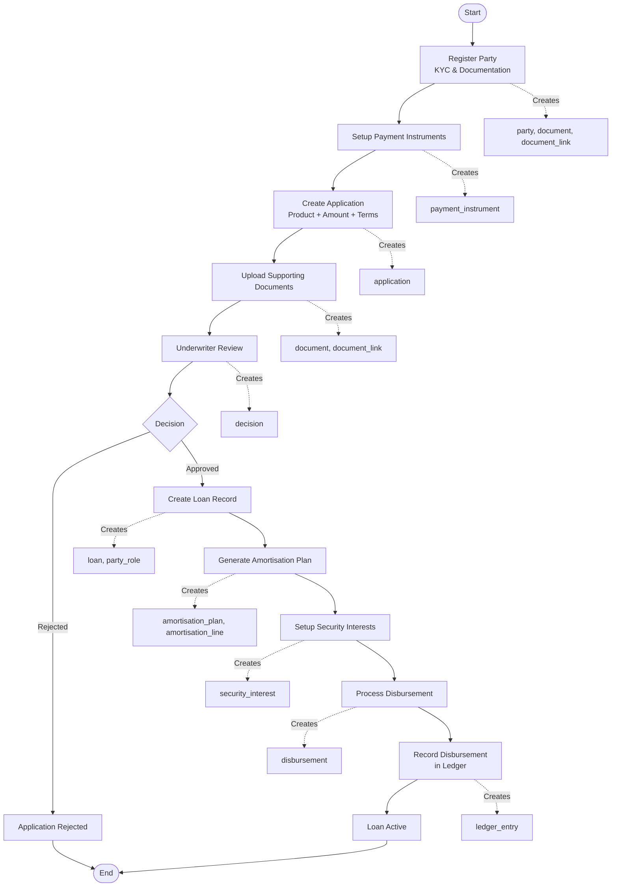
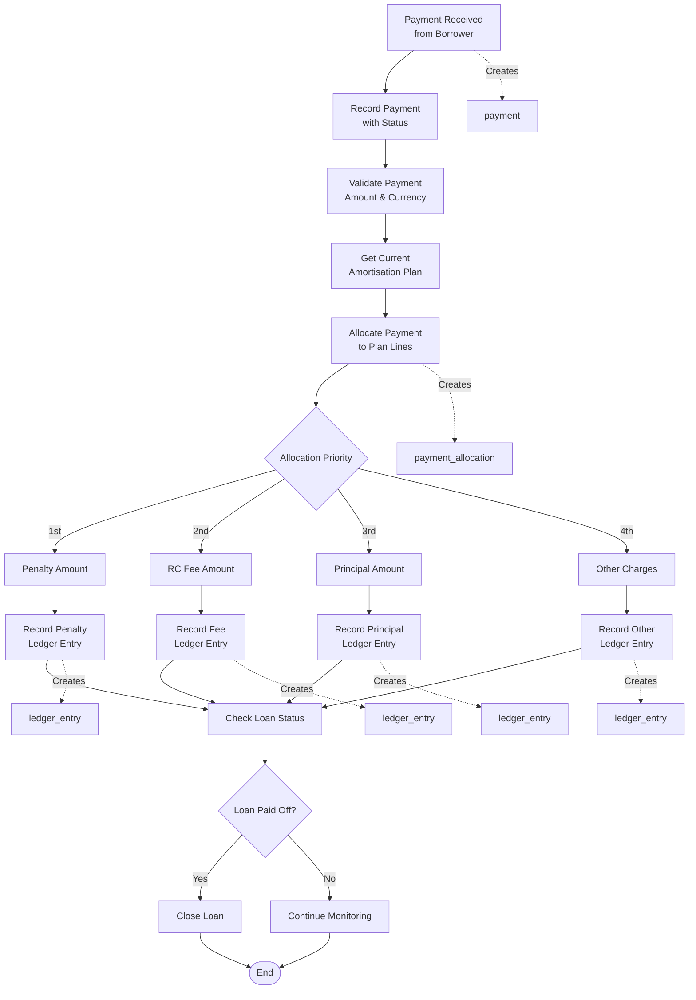
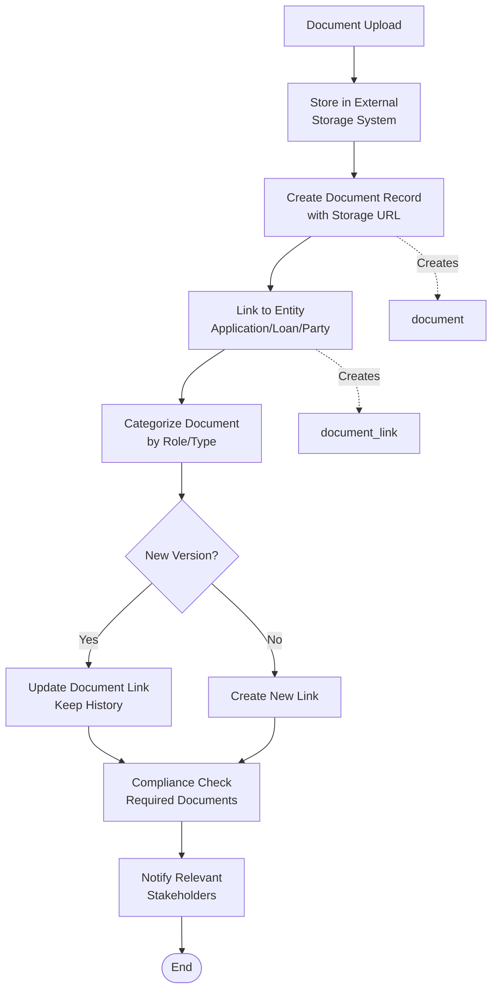

# Business Process Data Flow - Rently Lending Platform

## 1. Loan Application Process



## 2. Payment Processing & Allocation



## 3. Collections & Recovery Process

```mermaid
flowchart TD
    MONITOR[Daily Payment Monitoring] --> CHECK_DUE[Check Due Dates<br/>vs Payments Received]
    CHECK_DUE --> OVERDUE{Payment Overdue?}
    
    OVERDUE -->|No| CONTINUE_MONITOR[Continue Monitoring]
    OVERDUE -->|Yes| CALC_DPD[Calculate Days<br/>Past Due (DPD)]
    
    CALC_DPD --> DPD_BUCKET{DPD Bucket}
    DPD_BUCKET -->|1-30 days| SOFT_COLLECTIONS[Soft Collections<br/>SMS/Email Reminders]
    DPD_BUCKET -->|31-60 days| CALL_COLLECTIONS[Call Collections<br/>Direct Contact]
    DPD_BUCKET -->|60+ days| HARD_COLLECTIONS[Hard Collections<br/>Legal/Recovery Action]
    
    SOFT_COLLECTIONS --> LOG_SOFT[Log Collections Event<br/>Type: Reminder]
    CALL_COLLECTIONS --> LOG_CALL[Log Collections Event<br/>Type: Contact]
    HARD_COLLECTIONS --> LOG_HARD[Log Collections Event<br/>Type: Legal]
    
    LOG_SOFT --> RESPONSE_SOFT{Borrower Response?}
    LOG_CALL --> RESPONSE_CALL{Payment Promise?}
    LOG_HARD --> LEGAL_ACTION[Initiate Legal<br/>Recovery Process]
    
    RESPONSE_SOFT -->|Payment| PAYMENT_RECEIVED[Payment Received]
    RESPONSE_SOFT -->|No Response| ESCALATE[Escalate Collections]
    
    RESPONSE_CALL -->|Promise Kept| PAYMENT_RECEIVED
    RESPONSE_CALL -->|Promise Broken| ESCALATE
    
    LEGAL_ACTION --> SECURITY_ENFORCE[Enforce Security<br/>Interests]
    SECURITY_ENFORCE --> RECOVER[Partial/Full Recovery]
    
    PAYMENT_RECEIVED --> CONTINUE_MONITOR
    ESCALATE --> DPD_BUCKET
    RECOVER --> FINAL_LEDGER[Final Ledger<br/>Adjustments]
    FINAL_LEDGER --> END([End])
    CONTINUE_MONITOR --> END

    %% Data entities involved
    LOG_SOFT -.-> |Creates| CE1[collections_event]
    LOG_CALL -.-> |Creates| CE2[collections_event]
    LOG_HARD -.-> |Creates| CE3[collections_event]
    SECURITY_ENFORCE -.-> |References| SI[security_interest]
    FINAL_LEDGER -.-> |Creates| LE[ledger_entry]
```

## 4. Multi-Currency Operations

```mermaid
flowchart LR
    subgraph "FX Rate Management"
        RATE_FEED[External Rate Feed] --> UPDATE_FX[Update FX Rates<br/>Daily/Real-time]
        UPDATE_FX --> FX_TABLE[(fx_rate table)]
    end
    
    subgraph "Payment Processing"
        PAY_FOREIGN[Foreign Currency<br/>Payment] --> CONVERT[Convert to<br/>Functional Currency]
        CONVERT --> FX_TABLE
        FX_TABLE --> CALC[Calculate Converted<br/>Amount]
        CALC --> RECORD_BOTH[Record Both<br/>Original & Converted]
    end
    
    subgraph "Reporting"
        FX_TABLE --> REPORT[Multi-Currency<br/>Reports]
        RECORD_BOTH --> REPORT
        REPORT --> CONSOLIDATE[Consolidated<br/>Financial Position]
    end

    %% Data entities involved
    UPDATE_FX -.-> |Creates/Updates| FXR[fx_rate]
    RECORD_BOTH -.-> |Creates| P[payment], LE[ledger_entry]
```

## 5. Document Management Flow



## Key Data Flow Insights

### 📊 **Transaction Flow**
1. **Application** → **Decision** → **Loan** → **Amortisation Plan** → **Payments** → **Ledger**
2. All financial transactions create corresponding ledger entries
3. Payment allocations follow waterfall priority (Penalty → Fee → Principal → Other)

### 🔄 **State Management**
- Applications: draft → submitted → under_review → approved/rejected
- Loans: active → current → overdue → closed/written_off
- Payments: pending → completed → failed → reversed

### 👥 **Multi-Party Interactions**
- **Party Roles** link parties to loans with specific responsibilities
- **Security Interests** connect guarantors/collateral to loans
- **Payment Instruments** facilitate bi-directional money flow

### 📈 **Collections Lifecycle**
- Automatic DPD calculation triggers collection workflows
- Collections events create audit trail with actor attribution
- Recovery actions reference security interests for enforcement