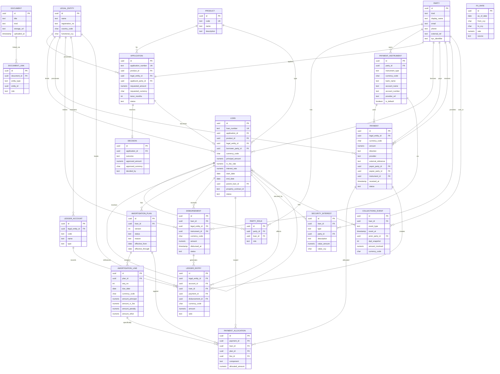

# Entity Relationship Diagram - Rently Lending Platform

## Key Relationships Summary

### Core Business Flow
1. **Party** applies for **Product** via **Application**
2. **Application** receives **Decision** 
3. Approved **Application** becomes **Loan**
4. **Loan** has **Amortisation Plan** with **Lines**
5. **Payments** are allocated against **Amortisation Lines**
6. All transactions create **Ledger Entries**

### Supporting Structures
- **Payment Instruments** facilitate payments and disbursements
- **Security Interests** provide collateral backing
- **Collections Events** track recovery activities
- **Documents** can be linked to any entity
- **FX Rates** support multi-currency operations